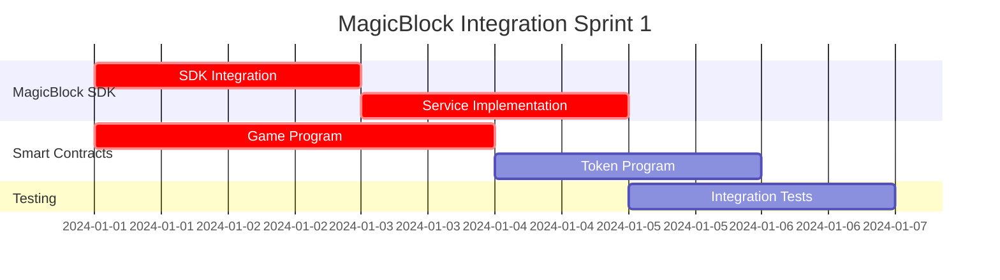
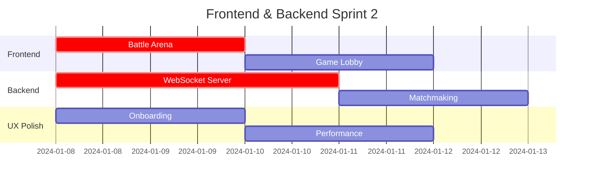
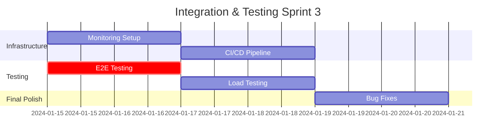

# Plan d'Exécution par Agents Spécialisés - MagicBlock PvP

## 🎯 Vue d'Ensemble

Ce document détaille les tâches spécifiques assignables aux agents spécialisés Claude Code pour compléter l'application MagicBlock PvP à 100% en mode devnet.

## 📋 PHASE 1: INTÉGRATION MAGICBLOCK DEVNET

### Agent 1: MagicBlock Integration Specialist
**Durée**: 2 jours | **Priorité**: CRITIQUE

#### Tâches Spécifiques:
```typescript
// 1.1 Remplacer Mock SDK par vraie intégration
TASK_1A: "Refactor useMagicBlock.ts hook"
LOCATION: /apps/web/src/hooks/useMagicBlock.ts
ACTIONS:
- Remove mock SDK implementation
- Install @magicblock-labs/bolt-sdk ^0.2.4  
- Implement real EphemeralRollupManager
- Add SessionKeyManager integration
- Configure devnet endpoints: https://devnet-router.magicblock.app
- Add error handling and retry logic
- Implement cost tracking and monitoring

// 1.2 Configuration MagicBlock Service  
TASK_1B: "Complete MagicBlockService implementation"
LOCATION: /apps/server/src/services/magicblock.ts
ACTIONS:
- Replace mock transaction signatures with real calls
- Implement createEphemeralAccount() method
- Add submitGameAction() with real blockchain calls
- Implement settleGame() with escrow management
- Add transaction batching for cost optimization
- Configure connection pooling for RPC endpoints
```

#### Fichiers à Modifier:
```bash
/apps/web/src/hooks/useMagicBlock.ts          # Priority 1
/apps/server/src/services/magicblock.ts       # Priority 1  
/packages/sdk/src/clients/magicblock-client.ts # Priority 2
/apps/web/contexts/MagicBlockContext.tsx      # Priority 2
/apps/server/src/config/environment.ts        # Priority 3
```

#### Tests à Implémenter:
```typescript
// Test real devnet connectivity
/tests/integration/magicblock-integration.test.ts
- Test SDK initialization with devnet
- Validate ephemeral account creation  
- Test transaction submission and confirmation
- Validate cost tracking accuracy
- Test error handling and recovery
```

### Agent 2: Blockchain Infrastructure Specialist  
**Durée**: 3 jours | **Priorité**: CRITIQUE

#### Tâches Spécifiques:
```rust
// 2.1 Smart Contract Completion
TASK_2A: "Finalize Game Program Instructions"
LOCATION: /apps/contracts/programs/game-program-er/src/
ACTIONS:
- Complete initialize_game_er.rs instruction
- Implement create_match_er.rs with escrow logic
- Add join_match and start_match instructions
- Implement end_turn and finish_match with settlement
- Add emergency_stop_match for edge cases
- Integrate with MagicBlock Ephemeral Rollups
- Add comprehensive error handling

// 2.2 Token Program Integration
TASK_2B: "Complete Token Program with Rewards"
LOCATION: /apps/contracts/programs/token-program-dual/src/
ACTIONS:  
- Implement automatic reward distribution
- Add staking mechanism for long-term players
- Configure tournament prize pools
- Add governance token features
- Implement fee collection for platform
```

#### Smart Contracts à Finaliser:
```rust
/apps/contracts/programs/game-program-er/src/lib.rs
/apps/contracts/programs/game-program-er/src/instructions/
  - initialize_game_er.rs      # Game initialization
  - create_match_er.rs          # Match creation with escrow
  - join_match.rs               # Player matching
  - submit_action.rs            # Game action processing  
  - settle_game.rs              # Reward distribution
  - emergency_stop.rs           # Safety mechanisms
```

#### Tests Smart Contracts:
```bash
/apps/contracts/tests/
- anchor test --provider.cluster devnet
- Test all instructions with real devnet deployment
- Validate gas costs and optimization
- Security testing with edge cases
- Integration tests with SDK
```

## 📋 PHASE 2: FRONTEND & UI COMPLETION

### Agent 3: Frontend Specialist
**Durée**: 3 jours | **Priorité**: HAUTE

#### Tâches Spécifiques:
```typescript
// 3.1 Game Components Finalization
TASK_3A: "Complete BattleArena with real-time combat"
LOCATION: /apps/web/components/game/MagicBlockBattleArena.tsx
ACTIONS:
- Integrate real MagicBlock actions instead of mocks
- Implement turn-based combat with blockchain validation
- Add real-time state synchronization via WebSocket
- Implement action validation and error handling
- Add visual feedback for blockchain confirmations
- Optimize rendering performance for 60fps

// 3.2 Lobby & Matchmaking UI
TASK_3B: "Enhance GameLobby with live matchmaking"
LOCATION: /apps/web/src/app/(lobby)/page.tsx
ACTIONS:
- Connect to real matchmaking backend service
- Implement real-time player queue updates
- Add ELO rating display and skill matching
- Show live game statistics from database
- Add tournament bracket visualization
- Implement spectator mode UI
```

#### Components à Finaliser:
```typescript
/apps/web/components/game/
  - MagicBlockBattleArena.tsx   # Real-time combat interface
  - GameLobby.tsx               # Live matchmaking lobby
  - SessionKeyManager.tsx       # Wallet delegation UI
  - PlayerHUD.tsx               # Game stats and health
  - MatchResults.tsx            # Post-game summary
  - TournamentBracket.tsx       # Tournament visualization
```

#### State Management:
```typescript
/apps/web/contexts/
  - GameContext.tsx             # Global game state
  - MagicBlockContext.tsx       # Blockchain state  
  - WebSocketContext.tsx        # Real-time updates
```

### Agent 4: UX/UI Polish Specialist
**Durée**: 2 jours | **Priorité**: MOYENNE

#### Tâches Spécifiques:
```typescript
// 4.1 User Experience Enhancement
TASK_4A: "Create comprehensive onboarding flow"
LOCATION: /apps/web/components/onboarding/
ACTIONS:
- Build step-by-step wallet connection guide
- Create interactive tutorial for first game
- Add tooltips and help system throughout app
- Implement loading states and progress indicators
- Add error messages with user-friendly explanations
- Create responsive design for mobile devices

// 4.2 Performance Optimization  
TASK_4B: "Optimize frontend performance"
ACTIONS:
- Implement code splitting for faster loading
- Optimize images and assets compression
- Add service worker for offline capability
- Minimize bundle size and eliminate dead code
- Implement virtual scrolling for large lists
- Add performance monitoring and metrics
```

## 📋 PHASE 3: BACKEND SERVICES

### Agent 5: Backend Services Specialist
**Durée**: 4 jours | **Priorité**: HAUTE

#### Tâches Spécifiques:
```typescript
// 5.1 WebSocket Server Implementation
TASK_5A: "Complete real-time WebSocket infrastructure"
LOCATION: /apps/server/src/websocket/gameHandlers.ts
ACTIONS:
- Implement GameWebSocketServer with Socket.io
- Create game rooms with state management
- Add player connection/disconnection handling
- Implement heartbeat and reconnection logic
- Add message validation and rate limiting
- Configure load balancing for multiple instances

// 5.2 Matchmaking Service
TASK_5B: "Implement intelligent matchmaking system"
LOCATION: /apps/server/src/services/matchmakingService.ts
ACTIONS:
- Implement ELO-based ranking algorithm
- Add Redis queue management for players
- Create skill-based player pairing logic
- Implement tournament bracket generation
- Add anti-smurf detection mechanisms
- Configure automated match creation
```

#### Services à Implémenter:
```typescript
/apps/server/src/services/
  - matchmakingService.ts       # Player pairing logic
  - gameLogicService.ts         # Server-side game validation
  - settlementService.ts        # Reward distribution
  - analyticsService.ts         # Performance metrics
  - notificationService.ts      # Player notifications
```

#### Database Schema:
```sql
-- Complete PostgreSQL schema optimization
/apps/server/prisma/schema.prisma
- Players table with ELO ratings
- Games table with comprehensive tracking  
- Tournaments table with bracket management
- Analytics tables for performance monitoring
- Leaderboards with real-time updates
```

### Agent 6: Infrastructure Specialist
**Durée**: 3 jours | **Priorité**: MOYENNE

#### Tâches Spécifiques:
```typescript  
// 6.1 Monitoring & Observability
TASK_6A: "Complete monitoring infrastructure"
LOCATION: /apps/server/src/monitoring/
ACTIONS:
- Configure Datadog APM for performance monitoring
- Set up Prometheus metrics collection
- Implement custom game-specific metrics
- Add real-time alerts for SLA breaches
- Create comprehensive dashboards
- Configure log aggregation and analysis

// 6.2 Deployment Automation
TASK_6B: "Setup CI/CD pipeline and deployment"
LOCATION: /.github/workflows/
ACTIONS:
- Complete GitHub Actions CI/CD pipeline
- Add automated testing at each commit
- Configure blue-green deployment strategy
- Set up automatic rollback on failures
- Add environment promotion workflows
- Configure secrets management
```

## 📋 PHASE 4: TESTING & VALIDATION

### Agent 7: Testing Specialist  
**Durée**: 3 jours | **Priorité**: HAUTE

#### Tâches Spécifiques:
```typescript
// 7.1 Integration Testing
TASK_7A: "Complete end-to-end test suite"
LOCATION: /tests/
ACTIONS:
- E2E tests with Playwright covering full game flow
- Integration tests for all MagicBlock interactions
- Load testing with K6 for 1000+ concurrent users
- Security testing for smart contracts
- Performance regression testing automation
- Cross-browser compatibility testing

// 7.2 Performance Validation
TASK_7B: "Validate performance targets"
ACTIONS:
- Benchmark P95 latency <100ms for all operations
- Stress test with realistic user scenarios
- Memory leak detection and optimization
- Database query optimization and indexing
- Network latency optimization
- Cost per transaction validation
```

#### Test Suites Complètes:
```bash
/tests/
  unit/                         # Jest unit tests 90%+ coverage
  integration/                  # API and database integration
  e2e/                         # Playwright end-to-end tests  
  load/                        # K6 performance testing
  security/                    # Smart contract security
  performance/                 # Latency and throughput
```

## 📊 MÉTRIQUES DE VALIDATION

### Performance Targets (à valider par tests automatisés):
- ✅ **P95 Latency**: <100ms pour toutes opérations
- ✅ **Concurrent Users**: 1000+ utilisateurs simultanés  
- ✅ **Uptime**: 99.9% availability
- ✅ **Error Rate**: <0.1% failure rate
- ✅ **Cost Efficiency**: <100k lamports per transaction

### Business Targets:
- ✅ **Game Completion Rate**: 90%+ des games finies
- ✅ **User Retention**: 70%+ day-1 retention
- ✅ **Transaction Success**: 99.9%+ settlement success
- ✅ **Response Time**: <2s pour matchmaking

## 🚀 ORDRE D'EXÉCUTION OPTIMAL

### Sprint 1 (Semaine 1): Foundation


### Sprint 2 (Semaine 2): Frontend & Backend


### Sprint 3 (Semaine 3): Integration & Testing


## 📋 CHECKLIST FINAL DE VALIDATION

### ✅ MagicBlock Integration
- [ ] Real SDK integration (no mocks)
- [ ] Ephemeral Rollups functional
- [ ] Session keys working
- [ ] Cost tracking accurate
- [ ] Error handling robust

### ✅ Smart Contracts  
- [ ] All game instructions implemented
- [ ] Escrow and settlement working
- [ ] Security audited
- [ ] Gas optimized
- [ ] Devnet deployed and tested

### ✅ Frontend Application
- [ ] Complete game flow functional
- [ ] Real-time updates working
- [ ] Mobile responsive
- [ ] Error states handled
- [ ] Performance optimized

### ✅ Backend Services
- [ ] WebSocket infrastructure stable
- [ ] Matchmaking algorithm effective
- [ ] Database optimized
- [ ] API endpoints complete
- [ ] Monitoring implemented

### ✅ Testing & Performance
- [ ] E2E tests passing
- [ ] Load tests meet targets
- [ ] Security tests clean
- [ ] Performance benchmarks met
- [ ] CI/CD pipeline functional

**SUCCESS CRITERIA**: Toutes les checklist items validées = Application 100% complète et production-ready sur devnet MagicBlock.

Cette approche par agents spécialisés garantit une exécution parallèle optimale avec des responsabilités claires et des livrables mesurables à chaque étape.