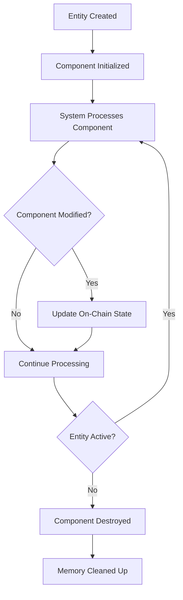

# BOLT ECS Architecture Guide

## Overview

BOLT (Blockchain Optimized Logic and Transactions) is a high-performance Entity Component System (ECS) framework designed specifically for on-chain gaming. This guide covers the comprehensive architecture, patterns, and implementation details for the Universal PvP platform.

## Table of Contents

- [ECS Fundamentals](#ecs-fundamentals)
- [BOLT Architecture](#bolt-architecture)
- [Component Design](#component-design)
- [System Implementation](#system-implementation)
- [Entity Management](#entity-management)
- [State Management](#state-management)
- [Performance Optimization](#performance-optimization)
- [Advanced Patterns](#advanced-patterns)
- [Testing Strategies](#testing-strategies)
- [Migration Guide](#migration-guide)

## ECS Fundamentals

### What is ECS?

Entity Component System is an architectural pattern that separates data (Components) from logic (Systems) and uses unique identifiers (Entities) to link them together.

```
Entity: Unique ID (e.g., Player #42)
    ├── Component: PlayerProfile { level: 25, class: "warrior" }
    ├── Component: PlayerStats { health: 120, attack: 85 }
    ├── Component: PlayerPosition { x: 100, y: 200 }
    └── Component: PlayerEquipment { weapon: sword_nft }

System: CombatSystem
    ├── Queries entities with Combat + Health + Stats components
    ├── Processes combat logic
    └── Updates component data
```

### Benefits for Gaming

1. **Modularity**: Easy to add/remove features without affecting core systems
2. **Performance**: Optimized data layout and processing
3. **Composability**: Mix and match components for different entity types
4. **Scalability**: Efficient handling of thousands of game entities
5. **Maintainability**: Clear separation of concerns

## BOLT Architecture

### Core Structure

```rust
// BOLT program structure
use bolt_lang::*;

// Component definition
#[component]
#[derive(Default, Clone, Copy)]
pub struct PlayerProfile {
    pub owner: Pubkey,
    pub username: [u8; 32],
    pub player_class: u8,
    pub level: u32,
    pub experience: u64,
    // ... other fields
}

// System definition
#[system]
pub mod player_system {
    pub fn level_up(
        ctx: Context<Components>,
        new_level: u32,
    ) -> Result<Components> {
        // System logic here
        Ok(ctx.accounts)
    }
}

// Entity creation
#[derive(Accounts)]
pub struct Components<'info> {
    #[account(mut)]
    pub player_profile: Account<'info, PlayerProfile>,
    #[account(mut)]
    pub player_stats: Account<'info, PlayerStats>,
    // ... other components
}
```

### Component Lifecycle



## Component Design

### Base Components

#### 1. PlayerProfile Component

```rust
// Player identity and progression data
#[component]
#[derive(Clone, Copy)]
pub struct PlayerProfile {
    pub owner: Pubkey,              // Wallet address
    pub username: [u8; 32],         // Display name
    pub player_class: u8,           // Character class enum
    pub level: u32,                 // Current level
    pub experience: u64,            // Total experience points
    pub total_matches: u32,         // Games played
    pub wins: u32,                  // Victories
    pub losses: u32,                // Defeats
    pub created_at: i64,            // Account creation timestamp
    pub last_match_at: i64,         // Last game timestamp
    pub is_active: bool,            // Account status
}

impl PlayerProfile {
    pub fn calculate_win_rate(&self) -> f64 {
        if self.total_matches == 0 {
            return 0.0;
        }
        self.wins as f64 / self.total_matches as f64
    }
    
    pub fn experience_to_next_level(&self) -> u64 {
        let next_level_exp = self.experience_required_for_level(self.level + 1);
        next_level_exp.saturating_sub(self.experience)
    }
    
    fn experience_required_for_level(&self, level: u32) -> u64 {
        // Exponential curve: level^2 * 1000
        (level as u64).pow(2) * 1000
    }
}
```

#### 2. PlayerStats Component

```rust
// Base attributes and derived stats
#[component]
#[derive(Clone, Copy)]
pub struct PlayerStats {
    pub health: u32,      // Hit points
    pub attack: u32,      // Damage output
    pub defense: u32,     // Damage reduction
    pub speed: u32,       // Initiative/movement
    pub mana: u32,        // Ability resource
}

impl PlayerStats {
    // Class-specific stat distributions
    pub fn for_class(player_class: u8) -> Self {
        match player_class {
            0 => Self::new_warrior(),    // Tank focused
            1 => Self::new_mage(),       // Magic focused
            2 => Self::new_archer(),     // Ranged focused
            3 => Self::new_rogue(),      // Speed focused
            _ => Self::default(),
        }
    }
    
    pub fn new_warrior() -> Self {
        Self {
            health: 120,    // +20% health
            attack: 85,     // +15% attack
            defense: 90,    // +30% defense
            speed: 60,      // -20% speed
            mana: 30,       // -40% mana
        }
    }
    
    // Apply level scaling
    pub fn with_level(mut self, level: u32) -> Self {
        let multiplier = 1.0 + (level as f64 - 1.0) * 0.1; // 10% per level
        self.health = (self.health as f64 * multiplier) as u32;
        self.attack = (self.attack as f64 * multiplier) as u32;
        self.defense = (self.defense as f64 * multiplier) as u32;
        self.speed = (self.speed as f64 * multiplier) as u32;
        self.mana = (self.mana as f64 * multiplier) as u32;
        self
    }

    // Calculate derived stats
    pub fn effective_attack(&self, equipment_bonus: &PlayerStats) -> u32 {
        self.attack.saturating_add(equipment_bonus.attack)
    }
    
    pub fn damage_reduction(&self, equipment_bonus: &PlayerStats) -> f64 {
        let total_defense = self.defense.saturating_add(equipment_bonus.defense);
        total_defense as f64 / (total_defense as f64 + 100.0)
    }
}
```

#### 3. PlayerHealth Component

```rust
// Current health and status tracking
#[component]
#[derive(Clone, Copy)]
pub struct PlayerHealth {
    pub current_health: u32,       // Current HP
    pub max_health: u32,           // Maximum HP
    pub current_mana: u32,         // Current MP
    pub max_mana: u32,            // Maximum MP
    pub is_alive: bool,           // Alive status
    pub last_damage_taken: i64,   // Last damage timestamp
    pub last_heal_received: i64,  // Last healing timestamp
}

impl PlayerHealth {
    pub fn new(stats: &PlayerStats) -> Self {
        Self {
            current_health: stats.health,
            max_health: stats.health,
            current_mana: stats.mana,
            max_mana: stats.mana,
            is_alive: true,
            last_damage_taken: 0,
            last_heal_received: 0,
        }
    }

    // Core health management
    pub fn take_damage(&mut self, damage: u32, timestamp: i64) -> bool {
        self.current_health = self.current_health.saturating_sub(damage);
        self.last_damage_taken = timestamp;
        
        if self.current_health == 0 {
            self.is_alive = false;
            return true; // Player died
        }
        false
    }

    pub fn heal(&mut self, amount: u32, timestamp: i64) {
        if self.is_alive {
            self.current_health = (self.current_health + amount).min(self.max_health);
            self.last_heal_received = timestamp;
        }
    }

    pub fn use_mana(&mut self, amount: u32) -> bool {
        if self.current_mana >= amount {
            self.current_mana -= amount;
            true
        } else {
            false
        }
    }

    // Utility functions
    pub fn health_percentage(&self) -> f64 {
        if self.max_health == 0 { return 0.0; }
        self.current_health as f64 / self.max_health as f64
    }

    pub fn is_critically_injured(&self) -> bool {
        self.health_percentage() < 0.25
    }

    pub fn can_act(&self) -> bool {
        self.is_alive && self.current_health > 0
    }
}
```

#### 4. Combat Components

```rust
// Combat statistics tracking
#[component]
#[derive(Clone, Copy)]
pub struct CombatStats {
    pub damage_dealt: u32,        // Total damage output
    pub damage_taken: u32,        // Total damage received
    pub actions_taken: u32,       // Total actions performed
    pub critical_hits: u32,       // Critical strike count
    pub kills: u32,              // Eliminations
    pub deaths: u32,             // Times eliminated
    pub assists: u32,            // Assist count
    pub match_mvp_count: u32,    // MVP awards
}

// Active status effects
#[component]
#[derive(Clone, Copy)]
pub struct ActiveEffects {
    pub effects: [StatusEffect; 8],    // Max 8 concurrent effects
    pub effect_count: u8,              // Current effect count
}

impl ActiveEffects {
    pub fn add_effect(&mut self, effect: StatusEffect) -> Result<(), &'static str> {
        if (self.effect_count as usize) >= self.effects.len() {
            return Err("Maximum effects reached");
        }
        
        // Check for existing effect of same type
        for i in 0..(self.effect_count as usize) {
            if self.effects[i].effect_type == effect.effect_type {
                // Replace existing effect if new one is stronger or longer
                if effect.strength >= self.effects[i].strength || 
                   effect.duration > self.effects[i].duration {
                    self.effects[i] = effect;
                    return Ok(());
                }
                return Err("Weaker effect already active");
            }
        }
        
        // Add new effect
        self.effects[self.effect_count as usize] = effect;
        self.effect_count += 1;
        Ok(())
    }
    
    pub fn update_effects(&mut self, current_time: i64) {
        let mut write_index = 0;
        
        for read_index in 0..(self.effect_count as usize) {
            if self.effects[read_index].expires_at > current_time {
                if write_index != read_index {
                    self.effects[write_index] = self.effects[read_index];
                }
                write_index += 1;
            }
        }
        
        // Clear remaining slots
        for i in write_index..(self.effect_count as usize) {
            self.effects[i] = StatusEffect::default();
        }
        
        self.effect_count = write_index as u8;
    }
}

// Ability cooldown tracking
#[component]
#[derive(Clone, Copy)]
pub struct AbilityCooldowns {
    pub basic_attack: i64,        // Last basic attack time
    pub special_ability: i64,     // Last special ability time
    pub ultimate: i64,            // Last ultimate time
    pub defensive_stance: i64,    // Last defensive action time
    pub heal: i64,               // Last heal time
    pub movement: i64,           // Last movement time
}
```

### Advanced Components

#### 1. Equipment System

```rust
#[component]
#[derive(Clone, Copy)]
pub struct PlayerEquipment {
    pub weapon: Option<Pubkey>,           // NFT weapon
    pub armor: Option<Pubkey>,            // NFT armor
    pub accessory: Option<Pubkey>,        // NFT accessory
    pub consumables: [Option<Pubkey>; 3], // Consumable items
    pub equipment_bonus: PlayerStats,     // Calculated bonuses
}

impl PlayerEquipment {
    pub async fn calculate_bonuses(&mut self, nft_data: &NFTDataProvider) -> Result<(), ProgramError> {
        let mut bonus = PlayerStats::default();
        
        // Weapon bonuses
        if let Some(weapon) = self.weapon {
            let weapon_stats = nft_data.get_item_stats(weapon).await?;
            bonus.attack += weapon_stats.attack_bonus;
            bonus.mana += weapon_stats.mana_bonus;
        }
        
        // Armor bonuses
        if let Some(armor) = self.armor {
            let armor_stats = nft_data.get_item_stats(armor).await?;
            bonus.health += armor_stats.health_bonus;
            bonus.defense += armor_stats.defense_bonus;
        }
        
        // Accessory bonuses
        if let Some(accessory) = self.accessory {
            let accessory_stats = nft_data.get_item_stats(accessory).await?;
            bonus.speed += accessory_stats.speed_bonus;
        }
        
        self.equipment_bonus = bonus;
        Ok(())
    }
}
```

#### 2. Match Participation

```rust
#[component]
#[derive(Clone, Copy)]
pub struct MatchParticipation {
    pub current_match: Option<u64>,       // Current match ID
    pub match_state: MatchPlayerState,    // Player's match state
    pub team_id: Option<u8>,             // Team assignment
    pub spawn_position: Position,         // Spawn location
    pub respawn_time: i64,               // Respawn timestamp
    pub score: u32,                      // Match score
}

#[derive(Clone, Copy, PartialEq)]
pub enum MatchPlayerState {
    NotInMatch,
    WaitingToStart,
    Active,
    Eliminated,
    Spectating,
    Disconnected,
}
```

## System Implementation

### Core Systems

#### 1. Combat System

```rust
#[system]
pub mod combat_system {
    use super::*;

    pub fn execute_attack(
        ctx: Context<CombatComponents>,
        target_entity: Pubkey,
        attack_type: u8,
    ) -> Result<CombatComponents> {
        let clock = Clock::get()?;
        let current_time = clock.unix_timestamp;

        // Load attacker components
        let mut attacker_health = PlayerHealth::from_account_info_mut(&ctx.accounts.attacker_health)?;
        let attacker_stats = PlayerStats::from_account_info(&ctx.accounts.attacker_stats)?;
        let attacker_equipment = PlayerEquipment::from_account_info(&ctx.accounts.attacker_equipment)?;
        let mut attacker_cooldowns = AbilityCooldowns::from_account_info_mut(&ctx.accounts.attacker_cooldowns)?;
        let mut attacker_combat_stats = CombatStats::from_account_info_mut(&ctx.accounts.attacker_combat_stats)?;

        // Load target components
        let mut target_health = PlayerHealth::from_account_info_mut(&ctx.accounts.target_health)?;
        let target_stats = PlayerStats::from_account_info(&ctx.accounts.target_stats)?;
        let target_equipment = PlayerEquipment::from_account_info(&ctx.accounts.target_equipment)?;

        // Validate attack preconditions
        if !attacker_health.can_act() {
            return Err(GameError::PlayerCannotAct.into());
        }

        let ability_type = match attack_type {
            0 => AbilityType::BasicAttack,
            1 => AbilityType::SpecialAbility,
            2 => AbilityType::Ultimate,
            _ => return Err(GameError::InvalidAbilityType.into()),
        };

        if !attacker_cooldowns.can_use_ability(ability_type, current_time) {
            return Err(GameError::AbilityOnCooldown.into());
        }

        // Calculate damage
        let base_damage = match attack_type {
            0 => attacker_stats.effective_attack(&attacker_equipment.equipment_bonus), // Basic attack
            1 => attacker_stats.effective_attack(&attacker_equipment.equipment_bonus) * 2, // Special
            2 => attacker_stats.effective_attack(&attacker_equipment.equipment_bonus) * 3, // Ultimate
            _ => 0,
        };

        // Apply defense reduction
        let damage_reduction = target_stats.damage_reduction(&target_equipment.equipment_bonus);
        let final_damage = (base_damage as f64 * (1.0 - damage_reduction)) as u32;

        // Check for critical hit (10% base chance)
        let is_critical = (clock.slot % 10) == 0;
        let actual_damage = if is_critical {
            final_damage * 2
        } else {
            final_damage
        };

        // Apply damage
        let target_died = target_health.take_damage(actual_damage, current_time);

        // Update attacker stats
        attacker_cooldowns.use_ability(ability_type, current_time);
        attacker_combat_stats.damage_dealt += actual_damage;
        attacker_combat_stats.actions_taken += 1;
        
        if is_critical {
            attacker_combat_stats.critical_hits += 1;
        }
        
        if target_died {
            attacker_combat_stats.kills += 1;
        }

        // Consume mana for special/ultimate abilities
        if attack_type > 0 {
            let mana_cost = match attack_type {
                1 => 20, // Special ability
                2 => 50, // Ultimate
                _ => 0,
            };
            
            if !attacker_health.use_mana(mana_cost) {
                return Err(GameError::InsufficientMana.into());
            }
        }

        // Save all modified components
        attacker_health.exit(ctx.program_id)?;
        attacker_cooldowns.exit(ctx.program_id)?;
        attacker_combat_stats.exit(ctx.program_id)?;
        target_health.exit(ctx.program_id)?;

        // Emit combat event
        emit!(CombatEvent {
            attacker: ctx.accounts.attacker.key(),
            target: target_entity,
            damage: actual_damage,
            attack_type,
            critical_hit: is_critical,
            target_defeated: target_died,
            timestamp: current_time,
        });

        Ok(ctx.accounts)
    }

    pub fn heal_player(
        ctx: Context<HealComponents>,
        heal_amount: u32,
    ) -> Result<HealComponents> {
        let clock = Clock::get()?;
        let current_time = clock.unix_timestamp;

        let mut player_health = PlayerHealth::from_account_info_mut(&ctx.accounts.player_health)?;
        let mut player_cooldowns = AbilityCooldowns::from_account_info_mut(&ctx.accounts.player_cooldowns)?;

        // Check cooldown
        if !player_cooldowns.can_use_ability(AbilityType::Heal, current_time) {
            return Err(GameError::AbilityOnCooldown.into());
        }

        // Consume mana
        if !player_health.use_mana(30) {
            return Err(GameError::InsufficientMana.into());
        }

        // Apply healing
        player_health.heal(heal_amount, current_time);
        player_cooldowns.use_ability(AbilityType::Heal, current_time);

        // Save components
        player_health.exit(ctx.program_id)?;
        player_cooldowns.exit(ctx.program_id)?;

        Ok(ctx.accounts)
    }
}

// Combat event for off-chain listeners
#[event]
pub struct CombatEvent {
    pub attacker: Pubkey,
    pub target: Pubkey,
    pub damage: u32,
    pub attack_type: u8,
    pub critical_hit: bool,
    pub target_defeated: bool,
    pub timestamp: i64,
}
```

#### 2. Progression System

```rust
#[system]
pub mod progression_system {
    use super::*;

    pub fn gain_experience(
        ctx: Context<ProgressionComponents>,
        experience_points: u64,
        source: ExperienceSource,
    ) -> Result<ProgressionComponents> {
        let mut player_profile = PlayerProfile::from_account_info_mut(&ctx.accounts.player_profile)?;
        let mut player_stats = PlayerStats::from_account_info_mut(&ctx.accounts.player_stats)?;

        let old_level = player_profile.level;
        player_profile.experience += experience_points;

        // Check for level up
        let new_level = calculate_level_from_experience(player_profile.experience);
        if new_level > old_level {
            player_profile.level = new_level;
            
            // Apply stat increases per level
            let stat_increase_per_level = 5;
            let levels_gained = new_level - old_level;
            
            player_stats.health += stat_increase_per_level * levels_gained;
            player_stats.attack += stat_increase_per_level * levels_gained;
            player_stats.defense += stat_increase_per_level * levels_gained;
            player_stats.speed += stat_increase_per_level * levels_gained;
            player_stats.mana += stat_increase_per_level * levels_gained;

            // Emit level up event
            emit!(LevelUpEvent {
                player: ctx.accounts.player.key(),
                old_level,
                new_level,
                experience: player_profile.experience,
                timestamp: Clock::get()?.unix_timestamp,
            });
        }

        // Save components
        player_profile.exit(ctx.program_id)?;
        player_stats.exit(ctx.program_id)?;

        Ok(ctx.accounts)
    }

    fn calculate_level_from_experience(experience: u64) -> u32 {
        // Solve for level in: experience = level^2 * 1000
        // level = sqrt(experience / 1000)
        let level = ((experience as f64 / 1000.0).sqrt()) as u32;
        level.max(1) // Minimum level 1
    }
}

#[derive(AnchorSerialize, AnchorDeserialize, Clone, Copy)]
pub enum ExperienceSource {
    Combat,
    Victory,
    Objective,
    Daily,
}

#[event]
pub struct LevelUpEvent {
    pub player: Pubkey,
    pub old_level: u32,
    pub new_level: u32,
    pub experience: u64,
    pub timestamp: i64,
}
```

#### 3. Match Management System

```rust
#[system]
pub mod match_system {
    use super::*;

    pub fn join_match(
        ctx: Context<MatchComponents>,
        match_id: u64,
        team_preference: Option<u8>,
    ) -> Result<MatchComponents> {
        let mut match_state = MatchState::from_account_info_mut(&ctx.accounts.match_state)?;
        let mut player_participation = MatchParticipation::from_account_info_mut(&ctx.accounts.player_participation)?;
        let player_profile = PlayerProfile::from_account_info(&ctx.accounts.player_profile)?;

        // Validate match state
        if match_state.state != GameState::WaitingForPlayers as u8 {
            return Err(GameError::MatchNotJoinable.into());
        }

        if match_state.players_count >= match_state.max_players {
            return Err(GameError::MatchFull.into());
        }

        // Check if player already in a match
        if player_participation.current_match.is_some() {
            return Err(GameError::AlreadyInMatch.into());
        }

        // Assign team
        let assigned_team = team_preference.unwrap_or_else(|| {
            // Auto-balance teams
            if match_state.team_a_count <= match_state.team_b_count {
                0 // Team A
            } else {
                1 // Team B
            }
        });

        // Update match state
        match_state.players_count += 1;
        if assigned_team == 0 {
            match_state.team_a_count += 1;
        } else {
            match_state.team_b_count += 1;
        }

        // Update player participation
        player_participation.current_match = Some(match_id);
        player_participation.match_state = MatchPlayerState::WaitingToStart;
        player_participation.team_id = Some(assigned_team);
        player_participation.spawn_position = get_spawn_position(assigned_team, match_state.players_count);

        // Check if match can start
        if match_state.players_count >= match_state.min_players {
            match_state.state = GameState::Starting as u8;
            match_state.start_time = Clock::get()?.unix_timestamp + 30; // 30 second countdown
        }

        // Save components
        match_state.exit(ctx.program_id)?;
        player_participation.exit(ctx.program_id)?;

        emit!(PlayerJoinedMatchEvent {
            player: ctx.accounts.player.key(),
            match_id,
            team: assigned_team,
            players_count: match_state.players_count,
            timestamp: Clock::get()?.unix_timestamp,
        });

        Ok(ctx.accounts)
    }

    pub fn end_match(
        ctx: Context<EndMatchComponents>,
        match_id: u64,
        winning_team: Option<u8>,
    ) -> Result<EndMatchComponents> {
        let mut match_state = MatchState::from_account_info_mut(&ctx.accounts.match_state)?;
        let clock = Clock::get()?;

        // Validate authority (only match creator or admin can end match)
        if ctx.accounts.authority.key() != match_state.creator && 
           !is_admin(ctx.accounts.authority.key()) {
            return Err(GameError::Unauthorized.into());
        }

        // Update match state
        match_state.state = GameState::Finished as u8;
        match_state.end_time = clock.unix_timestamp;
        match_state.winner = winning_team;

        // Calculate match statistics
        let match_duration = match_state.end_time - match_state.start_time;
        
        // Emit match ended event
        emit!(MatchEndedEvent {
            match_id,
            winner: winning_team,
            duration: match_duration,
            total_players: match_state.players_count,
            timestamp: clock.unix_timestamp,
        });

        match_state.exit(ctx.program_id)?;

        Ok(ctx.accounts)
    }

    fn get_spawn_position(team: u8, player_index: u8) -> Position {
        let base_x = if team == 0 { -100.0 } else { 100.0 };
        let offset_y = (player_index as f32 - 1.0) * 20.0;
        
        Position {
            x: base_x,
            y: offset_y,
            z: 0.0,
        }
    }
}

#[event]
pub struct PlayerJoinedMatchEvent {
    pub player: Pubkey,
    pub match_id: u64,
    pub team: u8,
    pub players_count: u8,
    pub timestamp: i64,
}

#[event]
pub struct MatchEndedEvent {
    pub match_id: u64,
    pub winner: Option<u8>,
    pub duration: i64,
    pub total_players: u8,
    pub timestamp: i64,
}
```

## Entity Management

### Entity Creation Pattern

```rust
// Entity factory for creating complete player entities
pub struct PlayerEntityFactory;

impl PlayerEntityFactory {
    pub async fn create_player_entity(
        program_id: &Pubkey,
        owner: &Pubkey,
        username: &str,
        player_class: u8,
    ) -> Result<Vec<Instruction>, ProgramError> {
        let mut instructions = Vec::new();
        
        // Generate entity ID
        let entity_id = Keypair::new();
        
        // Create PlayerProfile component
        let profile_account = Self::derive_component_address(
            program_id,
            &entity_id.pubkey(),
            "PlayerProfile"
        );
        
        let profile_instruction = create_component_instruction(
            program_id,
            &profile_account,
            PlayerProfile {
                owner: *owner,
                username: Self::string_to_bytes32(username),
                player_class,
                level: 1,
                experience: 0,
                total_matches: 0,
                wins: 0,
                losses: 0,
                created_at: Clock::get()?.unix_timestamp,
                last_match_at: 0,
                is_active: true,
            }
        );
        instructions.push(profile_instruction);
        
        // Create PlayerStats component
        let stats_account = Self::derive_component_address(
            program_id,
            &entity_id.pubkey(),
            "PlayerStats"
        );
        
        let stats = PlayerStats::for_class(player_class);
        let stats_instruction = create_component_instruction(
            program_id,
            &stats_account,
            stats
        );
        instructions.push(stats_instruction);
        
        // Create PlayerHealth component
        let health_account = Self::derive_component_address(
            program_id,
            &entity_id.pubkey(),
            "PlayerHealth"
        );
        
        let health_instruction = create_component_instruction(
            program_id,
            &health_account,
            PlayerHealth::new(&stats)
        );
        instructions.push(health_instruction);
        
        // Create other required components...
        // (CombatStats, ActiveEffects, AbilityCooldowns, etc.)
        
        Ok(instructions)
    }
    
    fn derive_component_address(
        program_id: &Pubkey,
        entity: &Pubkey,
        component_name: &str,
    ) -> Pubkey {
        Pubkey::find_program_address(
            &[
                b"component",
                entity.as_ref(),
                component_name.as_bytes()
            ],
            program_id
        ).0
    }
    
    fn string_to_bytes32(s: &str) -> [u8; 32] {
        let mut bytes = [0u8; 32];
        let s_bytes = s.as_bytes();
        let len = s_bytes.len().min(32);
        bytes[..len].copy_from_slice(&s_bytes[..len]);
        bytes
    }
}
```

### Entity Query System

```rust
// Query system for efficient entity retrieval
pub struct EntityQuery {
    pub required_components: Vec<String>,
    pub optional_components: Vec<String>,
    pub filters: Vec<ComponentFilter>,
}

impl EntityQuery {
    pub fn builder() -> EntityQueryBuilder {
        EntityQueryBuilder::new()
    }
    
    pub async fn execute(&self, program_id: &Pubkey) -> Result<Vec<Entity>, ProgramError> {
        let mut entities = Vec::new();
        
        // Implementation would query the blockchain for entities
        // matching the specified components and filters
        
        Ok(entities)
    }
}

pub struct EntityQueryBuilder {
    required: Vec<String>,
    optional: Vec<String>,
    filters: Vec<ComponentFilter>,
}

impl EntityQueryBuilder {
    pub fn new() -> Self {
        Self {
            required: Vec::new(),
            optional: Vec::new(),
            filters: Vec::new(),
        }
    }
    
    pub fn with_component(mut self, component: &str) -> Self {
        self.required.push(component.to_string());
        self
    }
    
    pub fn with_optional_component(mut self, component: &str) -> Self {
        self.optional.push(component.to_string());
        self
    }
    
    pub fn where_field(mut self, component: &str, field: &str, value: ComponentValue) -> Self {
        self.filters.push(ComponentFilter {
            component: component.to_string(),
            field: field.to_string(),
            operator: FilterOperator::Equals,
            value,
        });
        self
    }
    
    pub fn build(self) -> EntityQuery {
        EntityQuery {
            required_components: self.required,
            optional_components: self.optional,
            filters: self.filters,
        }
    }
}

// Usage example
pub async fn find_active_warriors(program_id: &Pubkey) -> Result<Vec<Entity>, ProgramError> {
    EntityQuery::builder()
        .with_component("PlayerProfile")
        .with_component("PlayerStats")
        .with_component("PlayerHealth")
        .where_field("PlayerProfile", "player_class", ComponentValue::U8(0)) // Warrior
        .where_field("PlayerProfile", "is_active", ComponentValue::Bool(true))
        .where_field("PlayerHealth", "is_alive", ComponentValue::Bool(true))
        .build()
        .execute(program_id)
        .await
}
```

## State Management

### Component State Synchronization

```typescript
// Client-side state management for BOLT components
export class ComponentStateManager {
    private componentCache: Map<string, ComponentState> = new Map();
    private subscriptions: Map<string, Set<StateCallback>> = new Map();
    private boltSDK: BoltSDK;

    constructor(boltSDK: BoltSDK) {
        this.boltSDK = boltSDK;
    }

    // Subscribe to component changes
    async subscribe<T>(
        componentType: string,
        entityId: PublicKey,
        callback: (data: T) => void
    ): Promise<() => void> {
        const key = `${componentType}:${entityId.toString()}`;
        
        if (!this.subscriptions.has(key)) {
            this.subscriptions.set(key, new Set());
            
            // Start monitoring this component
            await this.startMonitoring(componentType, entityId);
        }
        
        this.subscriptions.get(key)!.add(callback);
        
        // Return unsubscribe function
        return () => {
            const callbacks = this.subscriptions.get(key);
            if (callbacks) {
                callbacks.delete(callback);
                if (callbacks.size === 0) {
                    this.subscriptions.delete(key);
                    this.stopMonitoring(componentType, entityId);
                }
            }
        };
    }

    // Get current component state
    async getComponent<T>(
        componentType: string,
        entityId: PublicKey
    ): Promise<T | null> {
        const key = `${componentType}:${entityId.toString()}`;
        let state = this.componentCache.get(key);
        
        if (!state || this.isStale(state)) {
            state = await this.fetchComponent(componentType, entityId);
            this.componentCache.set(key, state);
        }
        
        return state.data as T;
    }

    // Update component optimistically
    async updateComponent<T>(
        componentType: string,
        entityId: PublicKey,
        updates: Partial<T>
    ): Promise<string> {
        const key = `${componentType}:${entityId.toString()}`;
        
        // Optimistic update
        const currentState = this.componentCache.get(key);
        if (currentState) {
            const optimisticData = { ...currentState.data, ...updates };
            this.componentCache.set(key, {
                ...currentState,
                data: optimisticData,
                version: currentState.version + 1
            });
            
            // Notify subscribers
            this.notifySubscribers(key, optimisticData);
        }
        
        try {
            // Send update to blockchain
            const instruction = await this.boltSDK.buildUpdateInstruction(
                componentType,
                entityId,
                updates
            );
            
            const signature = await this.boltSDK.sendTransaction([instruction]);
            
            // Confirm update
            await this.boltSDK.connection.confirmTransaction(signature);
            
            return signature;
        } catch (error) {
            // Revert optimistic update on failure
            await this.refreshComponent(componentType, entityId);
            throw error;
        }
    }

    private async startMonitoring(componentType: string, entityId: PublicKey): Promise<void> {
        const componentAddress = await this.boltSDK.deriveComponentAddress(componentType, entityId);
        
        this.boltSDK.connection.onAccountChange(
            componentAddress,
            (accountInfo) => {
                this.handleAccountChange(componentType, entityId, accountInfo);
            },
            'confirmed'
        );
    }

    private handleAccountChange(
        componentType: string,
        entityId: PublicKey,
        accountInfo: AccountInfo<Buffer>
    ): void {
        const key = `${componentType}:${entityId.toString()}`;
        
        try {
            const data = this.boltSDK.deserializeComponent(componentType, accountInfo.data);
            const newState: ComponentState = {
                data,
                version: Date.now(),
                lastUpdated: Date.now()
            };
            
            this.componentCache.set(key, newState);
            this.notifySubscribers(key, data);
        } catch (error) {
            console.error(`Failed to deserialize ${componentType} component:`, error);
        }
    }

    private notifySubscribers(key: string, data: any): void {
        const callbacks = this.subscriptions.get(key);
        if (callbacks) {
            callbacks.forEach(callback => callback(data));
        }
    }
}

interface ComponentState {
    data: any;
    version: number;
    lastUpdated: number;
}

type StateCallback = (data: any) => void;
```

## Performance Optimization

### Batch Operations

```rust
// Batch system for processing multiple entities efficiently
#[system]
pub mod batch_system {
    use super::*;

    pub fn batch_heal_players(
        ctx: Context<BatchHealComponents>,
        heal_amounts: Vec<u32>,
    ) -> Result<BatchHealComponents> {
        let clock = Clock::get()?;
        let current_time = clock.unix_timestamp;

        // Validate input
        if heal_amounts.len() != ctx.accounts.player_healths.len() {
            return Err(GameError::InvalidBatchSize.into());
        }

        let mut total_healing = 0u32;
        
        // Process each player
        for (i, heal_amount) in heal_amounts.iter().enumerate() {
            if let Some(player_health_info) = ctx.accounts.player_healths.get(i) {
                let mut player_health = PlayerHealth::from_account_info_mut(player_health_info)?;
                
                if player_health.is_alive {
                    player_health.heal(*heal_amount, current_time);
                    total_healing += *heal_amount;
                    player_health.exit(ctx.program_id)?;
                }
            }
        }

        emit!(BatchHealEvent {
            players_healed: heal_amounts.len() as u8,
            total_healing,
            timestamp: current_time,
        });

        Ok(ctx.accounts)
    }

    pub fn batch_apply_damage(
        ctx: Context<BatchDamageComponents>,
        damages: Vec<DamageData>,
    ) -> Result<BatchDamageComponents> {
        let clock = Clock::get()?;
        let current_time = clock.unix_timestamp;

        let mut total_damage = 0u32;
        let mut eliminations = 0u8;

        for damage_data in damages.iter() {
            let target_health_info = ctx.accounts.get_health_account(damage_data.target_index)?;
            let mut target_health = PlayerHealth::from_account_info_mut(target_health_info)?;

            if target_health.is_alive {
                let died = target_health.take_damage(damage_data.amount, current_time);
                total_damage += damage_data.amount;
                
                if died {
                    eliminations += 1;
                }
                
                target_health.exit(ctx.program_id)?;
            }
        }

        emit!(BatchDamageEvent {
            targets_hit: damages.len() as u8,
            total_damage,
            eliminations,
            timestamp: current_time,
        });

        Ok(ctx.accounts)
    }
}

#[derive(AnchorSerialize, AnchorDeserialize, Clone)]
pub struct DamageData {
    pub target_index: u8,
    pub amount: u32,
    pub damage_type: u8,
}
```

### Memory Optimization

```rust
// Optimized component layouts for minimal memory usage
#[component]
#[repr(C)]
#[derive(Clone, Copy, Default)]
pub struct CompactPlayerStats {
    // Pack stats into smaller data types where possible
    pub health: u16,        // Max 65,535 HP
    pub attack: u16,        // Max 65,535 attack
    pub defense: u16,       // Max 65,535 defense
    pub speed: u16,         // Max 65,535 speed
    pub mana: u16,          // Max 65,535 mana
    pub level: u16,         // Max level 65,535
    pub flags: u16,         // Bit flags for various boolean properties
}

impl CompactPlayerStats {
    pub fn set_flag(&mut self, flag: PlayerFlag, value: bool) {
        if value {
            self.flags |= flag as u16;
        } else {
            self.flags &= !(flag as u16);
        }
    }
    
    pub fn has_flag(&self, flag: PlayerFlag) -> bool {
        (self.flags & flag as u16) != 0
    }
}

#[repr(u16)]
pub enum PlayerFlag {
    IsActive = 1 << 0,
    IsInCombat = 1 << 1,
    IsStunned = 1 << 2,
    IsInvisible = 1 << 3,
    HasShield = 1 << 4,
    // ... up to 16 flags
}

// Component pooling for reduced allocation overhead
pub struct ComponentPool<T: Default + Clone> {
    available: Vec<T>,
    in_use: HashSet<usize>,
}

impl<T: Default + Clone> ComponentPool<T> {
    pub fn new(initial_size: usize) -> Self {
        let mut available = Vec::with_capacity(initial_size);
        for _ in 0..initial_size {
            available.push(T::default());
        }
        
        Self {
            available,
            in_use: HashSet::new(),
        }
    }
    
    pub fn acquire(&mut self) -> Option<(usize, &mut T)> {
        if let Some(component) = self.available.pop() {
            let index = self.available.len();
            self.in_use.insert(index);
            Some((index, self.available.get_mut(index)?))
        } else {
            None
        }
    }
    
    pub fn release(&mut self, index: usize) -> bool {
        if self.in_use.remove(&index) {
            if let Some(component) = self.available.get_mut(index) {
                *component = T::default(); // Reset to default state
                self.available.push(component.clone());
                true
            } else {
                false
            }
        } else {
            false
        }
    }
}
```

## Advanced Patterns

### Component Composition

```rust
// Trait-based component composition for flexible entity types
pub trait Combatant {
    fn get_health(&self) -> &PlayerHealth;
    fn get_health_mut(&mut self) -> &mut PlayerHealth;
    fn get_stats(&self) -> &PlayerStats;
    fn can_attack(&self) -> bool;
    fn take_damage(&mut self, damage: u32, timestamp: i64) -> bool;
}

pub trait Mobile {
    fn get_position(&self) -> &Position;
    fn get_position_mut(&mut self) -> &mut Position;
    fn move_to(&mut self, new_position: Position, timestamp: i64);
    fn get_movement_speed(&self) -> f32;
}

pub trait Equipable {
    fn get_equipment(&self) -> &PlayerEquipment;
    fn get_equipment_mut(&mut self) -> &mut PlayerEquipment;
    fn equip_item(&mut self, slot: EquipmentSlot, item: Option<Pubkey>) -> Result<(), EquipmentError>;
    fn calculate_equipment_bonuses(&self) -> PlayerStats;
}

// Composite entity types
pub struct PlayerEntity {
    pub profile: PlayerProfile,
    pub stats: PlayerStats,
    pub health: PlayerHealth,
    pub position: Position,
    pub equipment: PlayerEquipment,
    pub combat_stats: CombatStats,
    pub effects: ActiveEffects,
    pub cooldowns: AbilityCooldowns,
}

impl Combatant for PlayerEntity {
    fn get_health(&self) -> &PlayerHealth { &self.health }
    fn get_health_mut(&mut self) -> &mut PlayerHealth { &mut self.health }
    fn get_stats(&self) -> &PlayerStats { &self.stats }
    
    fn can_attack(&self) -> bool {
        self.health.is_alive && self.health.current_health > 0
    }
    
    fn take_damage(&mut self, damage: u32, timestamp: i64) -> bool {
        self.health.take_damage(damage, timestamp)
    }
}

impl Mobile for PlayerEntity {
    fn get_position(&self) -> &Position { &self.position }
    fn get_position_mut(&mut self) -> &mut Position { &mut self.position }
    
    fn move_to(&mut self, new_position: Position, timestamp: i64) {
        self.position = new_position;
        // Could trigger movement events, update last_moved timestamp, etc.
    }
    
    fn get_movement_speed(&self) -> f32 {
        let base_speed = self.stats.speed as f32;
        let equipment_bonus = self.equipment.equipment_bonus.speed as f32;
        let effect_modifier = self.calculate_speed_modifier();
        
        (base_speed + equipment_bonus) * effect_modifier
    }
}
```

### Event-Driven Architecture

```rust
// Event system for loose coupling between components
#[derive(Clone, Debug)]
pub enum GameEvent {
    PlayerCreated { player: Pubkey, class: u8 },
    PlayerLeveledUp { player: Pubkey, old_level: u32, new_level: u32 },
    CombatAction { attacker: Pubkey, target: Pubkey, damage: u32 },
    PlayerDefeated { player: Pubkey, killer: Option<Pubkey> },
    ItemEquipped { player: Pubkey, item: Pubkey, slot: u8 },
    MatchStarted { match_id: u64, players: Vec<Pubkey> },
    MatchEnded { match_id: u64, winner: Option<u8> },
}

pub trait EventHandler {
    fn handle_event(&mut self, event: &GameEvent) -> Result<(), ProgramError>;
}

pub struct EventBus {
    handlers: Vec<Box<dyn EventHandler>>,
}

impl EventBus {
    pub fn new() -> Self {
        Self {
            handlers: Vec::new(),
        }
    }
    
    pub fn register_handler(&mut self, handler: Box<dyn EventHandler>) {
        self.handlers.push(handler);
    }
    
    pub fn emit(&mut self, event: GameEvent) -> Result<(), ProgramError> {
        for handler in &mut self.handlers {
            handler.handle_event(&event)?;
        }
        Ok(())
    }
}

// Example event handler for updating statistics
pub struct StatisticsHandler;

impl EventHandler for StatisticsHandler {
    fn handle_event(&mut self, event: &GameEvent) -> Result<(), ProgramError> {
        match event {
            GameEvent::CombatAction { attacker, damage, .. } => {
                // Update attacker's combat statistics
                self.update_damage_dealt(*attacker, *damage)?;
            }
            GameEvent::PlayerDefeated { player, killer } => {
                // Update death count for defeated player
                self.update_deaths(*player)?;
                
                // Update kill count for killer
                if let Some(killer) = killer {
                    self.update_kills(*killer)?;
                }
            }
            GameEvent::PlayerLeveledUp { player, new_level, .. } => {
                // Track level progression statistics
                self.track_level_progression(*player, *new_level)?;
            }
            _ => {
                // Ignore other events
            }
        }
        Ok(())
    }
}
```

## Testing Strategies

### Unit Testing Components

```rust
#[cfg(test)]
mod tests {
    use super::*;

    #[test]
    fn test_player_health_damage() {
        let stats = PlayerStats::new_warrior();
        let mut health = PlayerHealth::new(&stats);
        
        assert_eq!(health.current_health, 120);
        assert_eq!(health.max_health, 120);
        assert!(health.is_alive);
        
        // Take damage
        let died = health.take_damage(50, 1000);
        assert_eq!(health.current_health, 70);
        assert!(!died);
        assert!(health.is_alive);
        
        // Take fatal damage
        let died = health.take_damage(100, 2000);
        assert_eq!(health.current_health, 0);
        assert!(died);
        assert!(!health.is_alive);
    }

    #[test]
    fn test_active_effects_management() {
        let mut effects = ActiveEffects::default();
        
        let poison_effect = StatusEffect {
            effect_type: EffectType::Poison,
            strength: 10.0,
            duration: 30,
            expires_at: 1030,
            caster: Pubkey::default(),
        };
        
        // Add effect
        assert!(effects.add_effect(poison_effect).is_ok());
        assert_eq!(effects.effect_count, 1);
        assert!(effects.has_effect(EffectType::Poison));
        
        // Update effects (should still be active)
        effects.update_effects(1000);
        assert_eq!(effects.effect_count, 1);
        
        // Update effects (should expire)
        effects.update_effects(1040);
        assert_eq!(effects.effect_count, 0);
        assert!(!effects.has_effect(EffectType::Poison));
    }

    #[test]
    fn test_combat_system_cooldowns() {
        let mut cooldowns = AbilityCooldowns::default();
        
        // Can use ability initially
        assert!(cooldowns.can_use_ability(AbilityType::BasicAttack, 1000));
        
        // Use ability
        assert!(cooldowns.use_ability(AbilityType::BasicAttack, 1000));
        
        // Cannot use immediately after
        assert!(!cooldowns.can_use_ability(AbilityType::BasicAttack, 1001));
        
        // Can use after cooldown
        assert!(cooldowns.can_use_ability(AbilityType::BasicAttack, 1003));
        
        // Check remaining cooldown
        assert_eq!(cooldowns.get_remaining_cooldown(AbilityType::BasicAttack, 1001), 1);
        assert_eq!(cooldowns.get_remaining_cooldown(AbilityType::BasicAttack, 1003), 0);
    }
}
```

### Integration Testing

```rust
#[cfg(test)]
mod integration_tests {
    use super::*;
    use anchor_lang::prelude::*;
    use solana_program_test::*;

    #[tokio::test]
    async fn test_combat_system_integration() {
        let program_test = ProgramTest::new(
            "universal_pvp",
            id(),
            processor!(process_instruction),
        );
        let (mut banks_client, payer, recent_blockhash) = program_test.start().await;

        // Create test players
        let attacker = Keypair::new();
        let target = Keypair::new();
        
        // Initialize player entities
        let init_attacker_tx = create_player_transaction(&attacker, "Attacker", 0);
        let init_target_tx = create_player_transaction(&target, "Target", 1);
        
        banks_client.process_transaction(init_attacker_tx).await.unwrap();
        banks_client.process_transaction(init_target_tx).await.unwrap();
        
        // Execute attack
        let attack_tx = create_attack_transaction(
            &attacker.pubkey(),
            &target.pubkey(),
            50, // damage
            0,  // basic attack
        );
        
        banks_client.process_transaction(attack_tx).await.unwrap();
        
        // Verify results
        let target_health = get_player_health(&mut banks_client, &target.pubkey()).await;
        assert_eq!(target_health.current_health, 30); // 80 base health - 50 damage
        assert!(target_health.is_alive);
        
        let attacker_stats = get_combat_stats(&mut banks_client, &attacker.pubkey()).await;
        assert_eq!(attacker_stats.damage_dealt, 50);
        assert_eq!(attacker_stats.actions_taken, 1);
    }

    async fn create_player_transaction(
        player: &Keypair,
        username: &str,
        class: u8,
    ) -> Transaction {
        // Implementation for creating player initialization transaction
        unimplemented!()
    }

    async fn create_attack_transaction(
        attacker: &Pubkey,
        target: &Pubkey,
        damage: u32,
        attack_type: u8,
    ) -> Transaction {
        // Implementation for creating attack transaction
        unimplemented!()
    }
}
```

### Load Testing

```typescript
// Load testing for BOLT ECS performance
describe('BOLT ECS Load Testing', () => {
    let boltSDK: BoltSDK;
    let testPlayers: Keypair[] = [];

    beforeAll(async () => {
        boltSDK = new BoltSDK({
            connection: new Connection('http://localhost:8899', 'confirmed'),
            wallet: testWallet
        });

        // Create test players
        for (let i = 0; i < 100; i++) {
            const player = Keypair.generate();
            await createPlayerEntity(player, `Player${i}`, i % 4);
            testPlayers.push(player);
        }
    });

    test('Concurrent combat actions', async () => {
        const startTime = performance.now();
        const promises: Promise<string>[] = [];

        // Execute 1000 concurrent combat actions
        for (let i = 0; i < 1000; i++) {
            const attacker = testPlayers[i % testPlayers.length];
            const target = testPlayers[(i + 1) % testPlayers.length];
            
            const promise = executeCombatAction(attacker.publicKey, target.publicKey, 10);
            promises.push(promise);
        }

        const results = await Promise.allSettled(promises);
        const endTime = performance.now();

        const successful = results.filter(r => r.status === 'fulfilled').length;
        const failed = results.filter(r => r.status === 'rejected').length;
        const avgTime = (endTime - startTime) / results.length;

        console.log(`Combat Actions: ${successful} successful, ${failed} failed`);
        console.log(`Average time per action: ${avgTime.toFixed(2)}ms`);

        expect(successful / results.length).toBeGreaterThan(0.95); // 95% success rate
        expect(avgTime).toBeLessThan(100); // Under 100ms average
    });

    test('Component query performance', async () => {
        const startTime = performance.now();
        
        // Query for active warriors
        const warriors = await boltSDK.queryEntities({
            required: ['PlayerProfile', 'PlayerStats', 'PlayerHealth'],
            filters: [
                { component: 'PlayerProfile', field: 'player_class', value: 0 },
                { component: 'PlayerProfile', field: 'is_active', value: true },
                { component: 'PlayerHealth', field: 'is_alive', value: true }
            ]
        });
        
        const endTime = performance.now();
        console.log(`Query returned ${warriors.length} entities in ${endTime - startTime}ms`);
        
        expect(warriors.length).toBeGreaterThan(0);
        expect(endTime - startTime).toBeLessThan(50); // Under 50ms for query
    });
});
```

This comprehensive BOLT ECS architecture guide provides developers with the knowledge and patterns needed to build high-performance, scalable gaming applications using MagicBlock's BOLT framework.