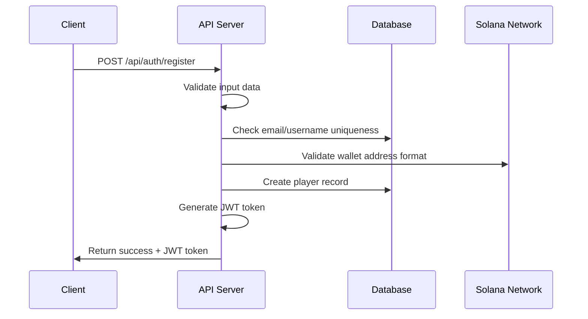
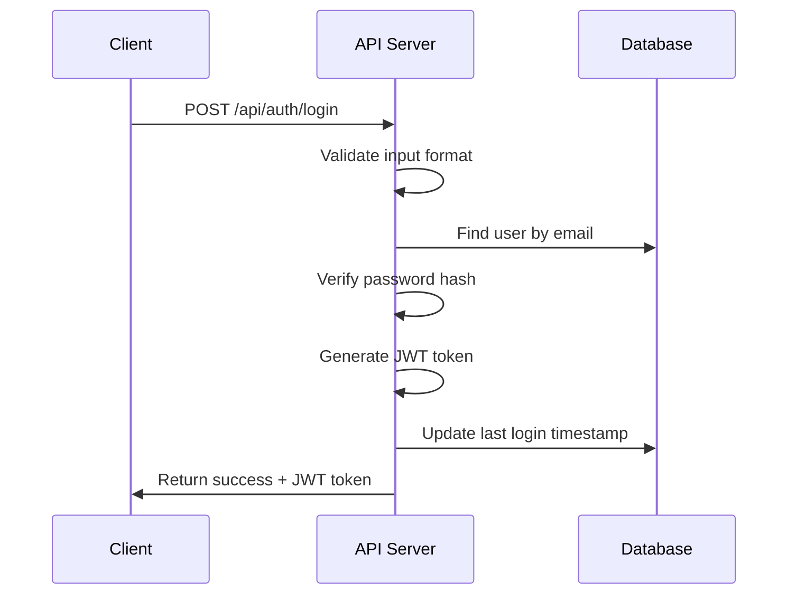
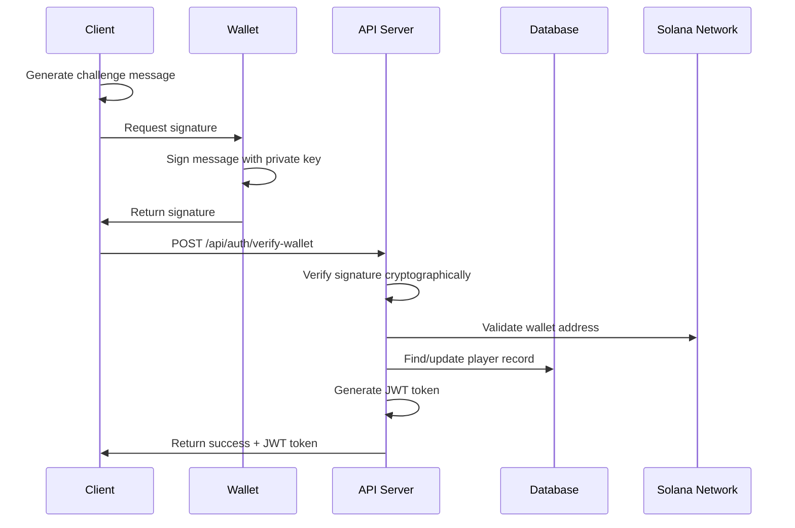
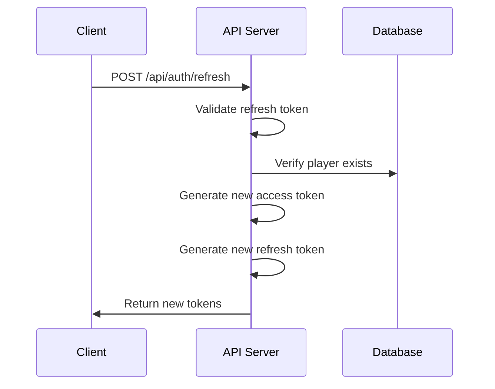

# SOL Duel Authentication Guide

## Overview

SOL Duel uses a hybrid authentication system combining traditional email/password authentication with Solana wallet-based verification. This approach provides flexibility for different user preferences while maintaining security and blockchain integration.

## Authentication Methods

### 1. Email/Password Authentication
Traditional web2 authentication for ease of use.

### 2. Wallet Signature Authentication
Blockchain-native authentication using Solana wallet signatures.

### 3. Hybrid Verification
Users can register with email/password and later verify their wallet for enhanced features.

## JWT Token Structure

SOL Duel uses JSON Web Tokens (JWT) for session management with the following structure:

```json
{
  "header": {
    "alg": "HS256",
    "typ": "JWT"
  },
  "payload": {
    "playerId": "player_12345",
    "walletAddress": "7xKXtg2CW87d97TXJSDpbD5jBkheTqA83TZRuJosgHU9",
    "username": "shadowgamer",
    "isVerified": true,
    "iat": 1609459200,
    "exp": 1610064000
  }
}
```

### Token Expiration
- **Access Token**: 7 days
- **Refresh Token**: 30 days (when available)

## Authentication Flows

### Flow 1: New User Registration



**Implementation Example:**

```typescript
async function registerPlayer(
  username: string,
  email: string,
  password: string,
  walletAddress: string
) {
  try {
    const response = await fetch('/api/auth/register', {
      method: 'POST',
      headers: {
        'Content-Type': 'application/json',
      },
      body: JSON.stringify({
        username,
        email,
        password,
        walletAddress,
      }),
    });

    const data = await response.json();

    if (data.success) {
      // Store JWT token
      localStorage.setItem('sol_duel_token', data.token);
      localStorage.setItem('sol_duel_user', JSON.stringify(data.player));
      
      return data.player;
    } else {
      throw new Error(data.message || 'Registration failed');
    }
  } catch (error) {
    console.error('Registration error:', error);
    throw error;
  }
}
```

### Flow 2: Email/Password Login



**Implementation Example:**

```typescript
async function loginWithPassword(email: string, password: string) {
  try {
    const response = await fetch('/api/auth/login', {
      method: 'POST',
      headers: {
        'Content-Type': 'application/json',
      },
      body: JSON.stringify({
        email,
        password,
      }),
    });

    const data = await response.json();

    if (data.success) {
      // Store authentication data
      localStorage.setItem('sol_duel_token', data.token);
      localStorage.setItem('sol_duel_user', JSON.stringify(data.player));
      
      // Set Authorization header for future requests
      axios.defaults.headers.common['Authorization'] = `Bearer ${data.token}`;
      
      return data.player;
    } else {
      throw new Error(data.message || 'Login failed');
    }
  } catch (error) {
    console.error('Login error:', error);
    throw error;
  }
}
```

### Flow 3: Wallet Signature Verification



**Implementation Example:**

```typescript
import { Connection, PublicKey, Keypair } from '@solana/web3.js';
import nacl from 'tweetnacl';
import bs58 from 'bs58';

async function verifyWallet(walletKeypair: Keypair) {
  try {
    // Create challenge message with timestamp
    const timestamp = Date.now();
    const message = `Login to SOL Duel - Timestamp: ${timestamp}`;
    
    // Convert message to bytes
    const messageBytes = new TextEncoder().encode(message);
    
    // Sign message with wallet private key
    const signature = nacl.sign.detached(messageBytes, walletKeypair.secretKey);
    const signatureBase58 = bs58.encode(signature);
    
    // Send verification request
    const response = await fetch('/api/auth/verify-wallet', {
      method: 'POST',
      headers: {
        'Content-Type': 'application/json',
      },
      body: JSON.stringify({
        walletAddress: walletKeypair.publicKey.toString(),
        signature: signatureBase58,
        message,
      }),
    });

    const data = await response.json();

    if (data.success) {
      localStorage.setItem('sol_duel_token', data.token);
      localStorage.setItem('sol_duel_user', JSON.stringify(data.player));
      
      return data.player;
    } else {
      throw new Error(data.message || 'Wallet verification failed');
    }
  } catch (error) {
    console.error('Wallet verification error:', error);
    throw error;
  }
}
```

### Flow 4: Token Refresh



**Implementation Example:**

```typescript
async function refreshAccessToken() {
  try {
    const refreshToken = localStorage.getItem('sol_duel_refresh_token');
    
    if (!refreshToken) {
      throw new Error('No refresh token available');
    }

    const response = await fetch('/api/auth/refresh', {
      method: 'POST',
      headers: {
        'Content-Type': 'application/json',
      },
      body: JSON.stringify({
        refreshToken,
      }),
    });

    const data = await response.json();

    if (data.success) {
      localStorage.setItem('sol_duel_token', data.token);
      localStorage.setItem('sol_duel_refresh_token', data.refreshToken);
      
      // Update axios default header
      axios.defaults.headers.common['Authorization'] = `Bearer ${data.token}`;
      
      return data.token;
    } else {
      throw new Error('Token refresh failed');
    }
  } catch (error) {
    console.error('Token refresh error:', error);
    // Redirect to login
    window.location.href = '/login';
    throw error;
  }
}
```

## Wallet Integration Examples

### Phantom Wallet Integration

```typescript
import { Connection, PublicKey, Transaction } from '@solana/web3.js';

interface PhantomProvider {
  isPhantom: boolean;
  publicKey: PublicKey | null;
  isConnected: boolean;
  signMessage(message: Uint8Array): Promise<{ signature: Uint8Array }>;
  connect(): Promise<{ publicKey: PublicKey }>;
  disconnect(): Promise<void>;
}

declare global {
  interface Window {
    solana?: PhantomProvider;
  }
}

async function connectPhantomWallet() {
  try {
    const provider = window.solana;
    
    if (!provider || !provider.isPhantom) {
      throw new Error('Phantom wallet not found');
    }

    // Connect to wallet
    const response = await provider.connect();
    console.log('Connected to wallet:', response.publicKey.toString());

    // Create challenge message
    const message = `Login to SOL Duel - Timestamp: ${Date.now()}`;
    const messageBytes = new TextEncoder().encode(message);

    // Sign message
    const signatureResult = await provider.signMessage(messageBytes);
    const signature = bs58.encode(signatureResult.signature);

    // Verify with SOL Duel API
    const authResponse = await fetch('/api/auth/verify-wallet', {
      method: 'POST',
      headers: {
        'Content-Type': 'application/json',
      },
      body: JSON.stringify({
        walletAddress: response.publicKey.toString(),
        signature,
        message,
      }),
    });

    const authData = await authResponse.json();

    if (authData.success) {
      localStorage.setItem('sol_duel_token', authData.token);
      return authData.player;
    } else {
      throw new Error(authData.message);
    }

  } catch (error) {
    console.error('Phantom wallet connection error:', error);
    throw error;
  }
}
```

### Solflare Wallet Integration

```typescript
import Solflare from '@solflare-wallet/sdk';

async function connectSolflareWallet() {
  try {
    const wallet = new Solflare();
    
    await wallet.connect();
    
    if (!wallet.publicKey) {
      throw new Error('Failed to connect to Solflare wallet');
    }

    // Create and sign message
    const message = `Login to SOL Duel - Timestamp: ${Date.now()}`;
    const messageBytes = new TextEncoder().encode(message);
    
    const signature = await wallet.signMessage(messageBytes);
    const signatureBase58 = bs58.encode(signature);

    // Verify with API
    const response = await fetch('/api/auth/verify-wallet', {
      method: 'POST',
      headers: {
        'Content-Type': 'application/json',
      },
      body: JSON.stringify({
        walletAddress: wallet.publicKey.toString(),
        signature: signatureBase58,
        message,
      }),
    });

    const data = await response.json();
    
    if (data.success) {
      localStorage.setItem('sol_duel_token', data.token);
      return data.player;
    } else {
      throw new Error(data.message);
    }

  } catch (error) {
    console.error('Solflare wallet error:', error);
    throw error;
  }
}
```

## Security Considerations

### Message Signing Best Practices

1. **Include Timestamps**: Prevent replay attacks
```typescript
const message = `Login to SOL Duel - Timestamp: ${Date.now()}`;
```

2. **Use Unique Nonces**: For additional security
```typescript
const nonce = crypto.getRandomValues(new Uint8Array(32));
const message = `Login to SOL Duel - Nonce: ${bs58.encode(nonce)}`;
```

3. **Domain Binding**: Include domain in message
```typescript
const message = `Login to SOL Duel on ${window.location.hostname} - ${Date.now()}`;
```

### Server-Side Verification

```javascript
// Node.js server-side verification
const nacl = require('tweetnacl');
const bs58 = require('bs58');
const { PublicKey } = require('@solana/web3.js');

function verifyWalletSignature(walletAddress, signature, message) {
  try {
    // Convert inputs
    const publicKey = new PublicKey(walletAddress);
    const signatureBuffer = bs58.decode(signature);
    const messageBuffer = new TextEncoder().encode(message);
    
    // Verify signature
    const isValid = nacl.sign.detached.verify(
      messageBuffer,
      signatureBuffer,
      publicKey.toBuffer()
    );

    return isValid;
  } catch (error) {
    console.error('Signature verification error:', error);
    return false;
  }
}
```

### JWT Security

1. **Secure Storage**: Use secure storage mechanisms
```typescript
// Use httpOnly cookies when possible
document.cookie = `sol_duel_token=${token}; Secure; HttpOnly; SameSite=Strict`;

// Or encrypted localStorage
import CryptoJS from 'crypto-js';

const encryptedToken = CryptoJS.AES.encrypt(token, secretKey).toString();
localStorage.setItem('sol_duel_token', encryptedToken);
```

2. **Token Validation**: Always validate tokens server-side
```javascript
const jwt = require('jsonwebtoken');

function validateToken(token) {
  try {
    const decoded = jwt.verify(token, process.env.JWT_SECRET);
    return decoded;
  } catch (error) {
    return null;
  }
}
```

## Error Handling

### Common Authentication Errors

| Error Code | Description | Solution |
|------------|-------------|----------|
| 401 | Invalid credentials | Check email/password or wallet signature |
| 403 | Account not verified | Complete wallet verification process |
| 409 | Email/username exists | Use different credentials |
| 429 | Rate limit exceeded | Wait and retry with exponential backoff |
| 500 | Server error | Check server status and retry |

### Error Handling Implementation

```typescript
class AuthError extends Error {
  constructor(
    public code: number,
    public message: string,
    public details?: string
  ) {
    super(message);
    this.name = 'AuthError';
  }
}

async function handleAuthRequest<T>(
  request: () => Promise<T>
): Promise<T> {
  try {
    return await request();
  } catch (error: any) {
    const status = error.response?.status;
    const data = error.response?.data;
    
    switch (status) {
      case 401:
        throw new AuthError(401, 'Authentication failed', data?.details);
      case 403:
        throw new AuthError(403, 'Access denied', data?.details);
      case 409:
        throw new AuthError(409, 'Resource conflict', data?.details);
      case 429:
        throw new AuthError(429, 'Rate limit exceeded', 'Please wait and try again');
      default:
        throw new AuthError(500, 'Authentication service error', error.message);
    }
  }
}

// Usage
try {
  const user = await handleAuthRequest(() => 
    loginWithPassword(email, password)
  );
} catch (error) {
  if (error instanceof AuthError) {
    console.error(`Auth error ${error.code}: ${error.message}`);
    // Handle specific error types
  }
}
```

## Session Management

### Automatic Token Refresh

```typescript
class AuthManager {
  private refreshTimer: NodeJS.Timeout | null = null;
  private token: string | null = null;

  constructor() {
    this.setupTokenRefresh();
  }

  private setupTokenRefresh() {
    const token = localStorage.getItem('sol_duel_token');
    
    if (token) {
      this.token = token;
      this.scheduleRefresh();
    }
  }

  private scheduleRefresh() {
    if (!this.token) return;

    try {
      const payload = JSON.parse(atob(this.token.split('.')[1]));
      const expirationTime = payload.exp * 1000;
      const currentTime = Date.now();
      const refreshTime = expirationTime - (5 * 60 * 1000); // 5 minutes before expiry

      if (refreshTime > currentTime) {
        this.refreshTimer = setTimeout(() => {
          this.refreshToken();
        }, refreshTime - currentTime);
      }
    } catch (error) {
      console.error('Token parsing error:', error);
    }
  }

  private async refreshToken() {
    try {
      const newToken = await refreshAccessToken();
      this.token = newToken;
      this.scheduleRefresh();
    } catch (error) {
      console.error('Token refresh failed:', error);
      this.logout();
    }
  }

  logout() {
    if (this.refreshTimer) {
      clearTimeout(this.refreshTimer);
    }
    
    localStorage.removeItem('sol_duel_token');
    localStorage.removeItem('sol_duel_refresh_token');
    localStorage.removeItem('sol_duel_user');
    
    this.token = null;
    
    // Redirect to login
    window.location.href = '/login';
  }
}

export const authManager = new AuthManager();
```

### Session Persistence

```typescript
// Check for existing session on app start
function initializeAuth(): boolean {
  const token = localStorage.getItem('sol_duel_token');
  const user = localStorage.getItem('sol_duel_user');

  if (token && user) {
    try {
      // Validate token format
      const payload = JSON.parse(atob(token.split('.')[1]));
      const isExpired = payload.exp * 1000 < Date.now();

      if (!isExpired) {
        // Set authorization header
        axios.defaults.headers.common['Authorization'] = `Bearer ${token}`;
        return true;
      } else {
        // Try to refresh if expired
        refreshAccessToken().catch(() => {
          clearAuth();
        });
      }
    } catch (error) {
      console.error('Invalid token format:', error);
      clearAuth();
    }
  }

  return false;
}

function clearAuth() {
  localStorage.removeItem('sol_duel_token');
  localStorage.removeItem('sol_duel_refresh_token'); 
  localStorage.removeItem('sol_duel_user');
  delete axios.defaults.headers.common['Authorization'];
}
```

This comprehensive authentication guide covers all aspects of integrating with SOL Duel's authentication system, from basic implementation to advanced security considerations and session management.