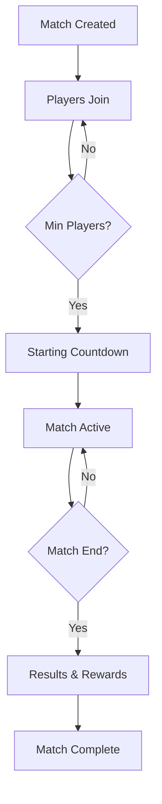

# Universal PvP - Quick Start Guide

## Overview

Welcome to the Universal PvP gaming platform! This guide will help you get up and running quickly with our MagicBlock-powered gaming infrastructure. You'll learn how to set up your development environment, create your first player, and participate in PvP battles.

## Table of Contents

- [Prerequisites](#prerequisites)
- [Installation](#installation)
- [Environment Setup](#environment-setup)
- [Your First Player](#your-first-player)
- [Joining a Match](#joining-a-match)
- [Combat Basics](#combat-basics)
- [Equipment and NFTs](#equipment-and-nfts)
- [Advanced Features](#advanced-features)
- [Next Steps](#next-steps)

## Prerequisites

### Required Software

```bash
# Node.js (version 16 or higher)
node --version  # Should be >= 16.0.0

# Rust and Cargo
rustc --version  # Should be >= 1.70.0

# Solana CLI
solana --version  # Should be >= 1.16.0

# Git
git --version
```

### Solana Wallet

1. Install a Solana wallet (Phantom, Solflare, or Backpack recommended)
2. Create a new wallet or import existing one
3. Get some SOL for devnet testing:

```bash
# Switch to devnet
solana config set --url devnet

# Request airdrop
solana airdrop 2
```

## Installation

### Clone the Repository

```bash
git clone https://github.com/universal-pvp/platform.git
cd platform
```

### Install Dependencies

```bash
# Install Node.js dependencies
npm install

# Install Rust dependencies and build programs
cargo build-bolt --manifest-path src/bolt/Cargo.toml
anchor build

# Install frontend dependencies
cd src/frontend
npm install
cd ../..
```

### Verify Installation

```bash
# Run tests to verify everything is working
npm test
npm run test:bolt
```

## Environment Setup

### 1. Environment Variables

Create a `.env` file in the project root:

```bash
# .env
SOLANA_NETWORK=devnet
SOLANA_RPC_URL=https://api.devnet.solana.com
MAGICBLOCK_API_KEY=your_api_key_here
EPHEMERAL_ROLLUP_ENDPOINT=https://api-devnet.magicblock.gg/rollup
SESSION_KEY_PROGRAM_ID=SessK3yManag3rPr0gramID1111111111111
MAGIC_ROUTER_ENDPOINT=https://router-devnet.magicblock.gg

# Database (for development)
DATABASE_URL=sqlite:./dev.db
REDIS_URL=redis://localhost:6379

# API Configuration
API_PORT=3000
FRONTEND_PORT=3001
```

### 2. Get MagicBlock API Key

1. Visit [MagicBlock Developer Portal](https://developers.magicblock.gg)
2. Create an account and new project
3. Copy your API key to the `.env` file

### 3. Deploy Programs

```bash
# Deploy to devnet
npm run deploy:devnet

# Initialize MagicBlock components
npm run deploy:bolt
npm run deploy:er
```

## Your First Player

### 1. Start the Development Servers

```bash
# Terminal 1 - Backend API
npm run dev

# Terminal 2 - Frontend
cd src/frontend
npm run dev

# Terminal 3 - Database (if using local setup)
redis-server
```

### 2. Connect Your Wallet

1. Open `http://localhost:3001` in your browser
2. Click "Connect Wallet" and select your Solana wallet
3. Approve the connection request

### 3. Create Your Player Profile

```typescript
// Example: Creating a player using the SDK
import { UniversalPvPSDK } from '@universal-pvp/sdk';

const sdk = new UniversalPvPSDK({
  connection: new Connection('https://api.devnet.solana.com'),
  wallet: yourWallet
});

// Create player profile
const playerSignature = await sdk.createPlayer({
  username: "CryptoWarrior",
  playerClass: 0, // 0=Warrior, 1=Mage, 2=Archer, 3=Rogue
});

console.log('Player created:', playerSignature);
```

### 4. Choose Your Class

Each class has unique stats and abilities:

| Class | Health | Attack | Defense | Speed | Mana |
|-------|--------|--------|---------|-------|------|
| Warrior | 120 | 85 | 90 | 60 | 30 |
| Mage | 80 | 100 | 50 | 70 | 150 |
| Archer | 90 | 95 | 60 | 110 | 80 |
| Rogue | 85 | 90 | 55 | 120 | 70 |

### 5. Complete Player Registration

Using the web interface:

1. Navigate to "Create Player" page
2. Enter your username
3. Select your preferred class
4. Confirm transaction in your wallet
5. Wait for transaction confirmation

## Joining a Match

### 1. Browse Available Matches

```typescript
// Find available matches
const matches = await sdk.getAvailableMatches({
  gameMode: 'pvp',
  maxPlayers: 8,
  status: 'waiting'
});

console.log('Available matches:', matches);
```

### 2. Join a Match

```typescript
// Join a match
const joinSignature = await sdk.joinMatch({
  matchId: matches[0].id,
  teamPreference: 0 // Optional: 0 for team A, 1 for team B
});

// Or create your own match
const createSignature = await sdk.createMatch({
  name: "Epic Battle Arena",
  maxPlayers: 8,
  gameMode: "team_deathmatch",
  mapId: "arena_classic"
});
```

### 3. Match Lifecycle



## Combat Basics

### 1. Understanding Combat

Combat in Universal PvP uses a turn-based system with real-time elements:

- **Actions**: Each player can perform actions with cooldowns
- **Health/Mana**: Resources that limit your capabilities
- **Abilities**: Different attack types with varying power and cost

### 2. Basic Combat Commands

```typescript
// Execute basic attack
const attackResult = await sdk.executeAttack({
  targetPlayer: enemyPlayerPubkey,
  attackType: 0, // 0=basic, 1=special, 2=ultimate
  damage: 25
});

// Use healing ability
const healResult = await sdk.heal({
  amount: 30,
  manaRequired: 30
});

// Move position (in spatial games)
const moveResult = await sdk.movePlayer({
  x: newX,
  y: newY,
  z: newZ
});
```

### 3. Combat Strategy

**Warrior Strategy:**
- High health and defense - perfect for tanking damage
- Use basic attacks frequently (low cooldown)
- Save ultimate for finishing moves
- Protect weaker teammates

**Mage Strategy:**
- High mana pool for frequent special abilities
- Keep distance from enemies
- Use area-of-effect abilities
- Manage mana carefully

**Archer Strategy:**
- High speed for positioning advantages
- Balance between attack and movement
- Use hit-and-run tactics
- Target low-health enemies

**Rogue Strategy:**
- Highest speed for first strikes
- Focus on quick eliminations
- Use stealth and mobility
- Target isolated enemies

### 4. Status Effects

Players can be affected by various status effects:

```typescript
// Check active effects
const playerData = await sdk.getPlayerState(playerPubkey);
console.log('Active effects:', playerData.activeEffects);

// Common effects:
// - AttackBoost: Increased damage output
// - DefenseBoost: Reduced damage taken
// - SpeedBoost: Faster cooldowns
// - Poison: Damage over time
// - Shield: Absorbs damage
```

## Equipment and NFTs

### 1. Equipment System

Equipment provides stat bonuses and special effects:

```typescript
// View player equipment
const equipment = await sdk.getPlayerEquipment(playerPubkey);

console.log('Equipped items:', {
  weapon: equipment.weapon,
  armor: equipment.armor,
  accessory: equipment.accessory,
  bonuses: equipment.equipmentBonus
});
```

### 2. Equipping NFT Items

```typescript
// Equip an NFT weapon
const equipResult = await sdk.equipItem({
  itemMint: weaponNFTPubkey,
  slot: 'weapon'
});

// Unequip item
const unequipResult = await sdk.unequipItem({
  slot: 'weapon'
});
```

### 3. Item Rarity and Stats

| Rarity | Attack Bonus | Defense Bonus | Special Effects |
|--------|-------------|---------------|-----------------|
| Common | +5-10 | +5-10 | None |
| Uncommon | +11-20 | +11-20 | Minor effects |
| Rare | +21-35 | +21-35 | Moderate effects |
| Epic | +36-50 | +36-50 | Major effects |
| Legendary | +51+ | +51+ | Unique abilities |

## Advanced Features

### 1. Session Keys for Seamless Gaming

```typescript
// Create a session key for uninterrupted gameplay
const sessionKey = await sdk.createSession({
  duration: 3600, // 1 hour
  maxSpend: 0.1 * LAMPORTS_PER_SOL, // 0.1 SOL spending limit
  allowedPrograms: [GAME_PROGRAM_ID, TOKEN_PROGRAM_ID]
});

// All subsequent game actions use the session key automatically
const attackWithSession = await sdk.executeAttack({
  targetPlayer: enemyPubkey,
  attackType: 0,
  damage: 25,
  useSession: true
});
```

### 2. Ephemeral Rollups for Fast Gaming

```typescript
// Fast matches are automatically routed to ephemeral rollups
const fastMatch = await sdk.createMatch({
  name: "Lightning Arena",
  maxPlayers: 4,
  gameMode: "quick_battle",
  useEphemeralRollup: true // Automatic for quick matches
});

// Monitor rollup performance
const rollupStats = await sdk.getRollupStats(fastMatch.rollupId);
console.log('Rollup performance:', rollupStats);
```

### 3. Real-time Updates

```typescript
// Subscribe to player state changes
const unsubscribe = await sdk.subscribeToPlayerState(
  playerPubkey,
  (playerState) => {
    console.log('Player state updated:', playerState);
    updateUI(playerState);
  }
);

// Subscribe to match events
const matchUnsubscribe = await sdk.subscribeToMatch(
  matchId,
  (event) => {
    switch (event.type) {
      case 'player_joined':
        console.log('New player joined:', event.player);
        break;
      case 'combat_action':
        console.log('Combat action:', event.action);
        break;
      case 'match_ended':
        console.log('Match ended:', event.result);
        break;
    }
  }
);
```

### 4. Tournament System

```typescript
// Create a tournament
const tournament = await sdk.createTournament({
  name: "Weekly Championship",
  entryFee: 0.01 * LAMPORTS_PER_SOL,
  maxParticipants: 64,
  prizePool: 5 * LAMPORTS_PER_SOL,
  format: "single_elimination"
});

// Register for tournament
const registrationResult = await sdk.registerForTournament({
  tournamentId: tournament.id
});
```

## Performance Optimization

### 1. Batch Operations

```typescript
// Batch multiple operations for better performance
const batchResults = await sdk.batchExecute([
  {
    type: 'attack',
    target: enemy1Pubkey,
    damage: 25
  },
  {
    type: 'heal',
    amount: 20
  },
  {
    type: 'move',
    position: { x: 100, y: 200, z: 0 }
  }
]);
```

### 2. Optimistic Updates

```typescript
// Enable optimistic updates for responsive UI
sdk.setOptimisticUpdates(true);

// UI updates immediately, blockchain update happens async
const result = await sdk.executeAttack({
  targetPlayer: enemyPubkey,
  attackType: 0,
  damage: 25,
  optimistic: true
});
```

### 3. Caching Strategy

```typescript
// Configure caching for better performance
sdk.setCacheStrategy({
  playerState: { ttl: 30000 }, // 30 seconds
  matchState: { ttl: 10000 },  // 10 seconds
  leaderboard: { ttl: 300000 } // 5 minutes
});
```

## Error Handling

### Common Issues and Solutions

#### 1. Transaction Failures

```typescript
try {
  const result = await sdk.executeAttack({...});
} catch (error) {
  if (error.code === 'INSUFFICIENT_FUNDS') {
    console.log('Need more SOL for transaction fees');
    // Request airdrop or show funding UI
  } else if (error.code === 'ABILITY_ON_COOLDOWN') {
    console.log('Ability still cooling down');
    // Show cooldown timer in UI
  } else if (error.code === 'SESSION_EXPIRED') {
    console.log('Session key expired');
    // Create new session
    await sdk.createSession({...});
  }
}
```

#### 2. Network Issues

```typescript
// Configure retry logic
sdk.setRetryConfig({
  maxRetries: 3,
  retryDelay: 1000, // 1 second
  exponentialBackoff: true
});

// Handle network failures gracefully
const result = await sdk.executeAttackWithRetry({...});
```

#### 3. Rollup Failures

```typescript
// Automatic fallback to mainnet if rollup fails
sdk.setFallbackStrategy({
  enableMainnetFallback: true,
  fallbackThreshold: 5000 // 5 second timeout
});
```

## Testing Your Implementation

### 1. Unit Tests

```typescript
// Test player creation
describe('Player Creation', () => {
  test('Creates warrior with correct stats', async () => {
    const player = await sdk.createPlayer({
      username: 'TestWarrior',
      playerClass: 0
    });
    
    const playerData = await sdk.getPlayerState(player.pubkey);
    expect(playerData.stats.health).toBe(120);
    expect(playerData.stats.attack).toBe(85);
  });
});
```

### 2. Integration Tests

```typescript
// Test full combat flow
describe('Combat System', () => {
  test('Complete battle scenario', async () => {
    // Create two players
    const player1 = await createTestPlayer('Attacker', 0);
    const player2 = await createTestPlayer('Target', 1);
    
    // Create match
    const match = await sdk.createMatch({...});
    
    // Join match
    await sdk.joinMatch({ matchId: match.id, player: player1 });
    await sdk.joinMatch({ matchId: match.id, player: player2 });
    
    // Execute combat
    const result = await sdk.executeAttack({
      attacker: player1.pubkey,
      target: player2.pubkey,
      attackType: 0,
      damage: 50
    });
    
    // Verify results
    const updatedTarget = await sdk.getPlayerState(player2.pubkey);
    expect(updatedTarget.health.current).toBe(30); // 80 - 50
  });
});
```

## Next Steps

### 1. Explore Advanced Features

- **Custom Game Modes**: Create your own battle formats
- **Guild System**: Form alliances with other players
- **Crafting System**: Create and enhance equipment
- **Marketplace**: Trade NFT items with other players

### 2. Join the Community

- **Discord**: Join our developer community
- **GitHub**: Contribute to the open-source project
- **Documentation**: Read the full technical documentation
- **Tournaments**: Participate in official competitions

### 3. Build Your Own Game

The Universal PvP platform provides the foundation for building your own games:

```typescript
// Extend the base game with custom mechanics
class MyCustomGame extends UniversalPvPSDK {
  async customAbility(params) {
    // Implement your unique game mechanics
  }
  
  async specialGameMode(params) {
    // Create custom game modes
  }
}
```

### 4. Resources

- **Full API Documentation**: `/docs/API_REFERENCE.md`
- **MagicBlock Integration Guide**: `/docs/MAGICBLOCK_INTEGRATION.md`
- **BOLT ECS Architecture**: `/docs/BOLT_ECS_ARCHITECTURE.md`
- **Example Projects**: `/examples/`
- **Community Tutorials**: [community.universalpvp.io](https://community.universalpvp.io)

## Support

If you encounter any issues or have questions:

1. **Check the FAQ**: Common issues and solutions
2. **Discord Support**: Real-time help from the community
3. **GitHub Issues**: Report bugs and request features
4. **Documentation**: Comprehensive guides and references

Welcome to the future of decentralized gaming! 🎮⚡