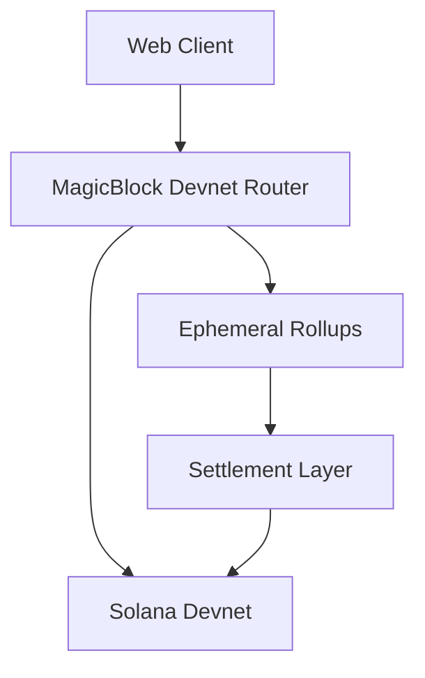
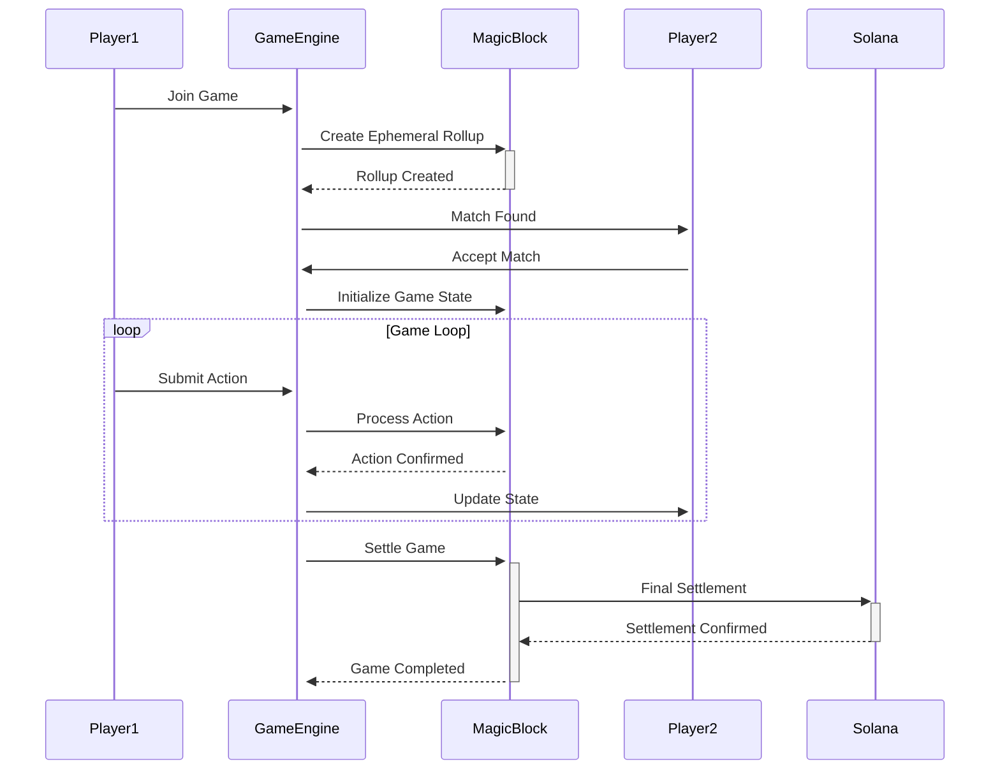

# ADR-003: MagicBlock Devnet Integration Strategy

## Status
Accepted

## Context
The MagicBlock PvP application needs to be completed as a production-ready application using exclusively MagicBlock devnet endpoints. The current codebase has comprehensive architecture but lacks real MagicBlock SDK integration, using mock implementations instead.

## Decision Drivers
- **Cost Optimization**: Use free devnet endpoints (`https://devnet-router.magicblock.app`)
- **Performance Requirements**: Sub-100ms P95 latency target
- **Scalability**: Support 1000+ concurrent players
- **Reliability**: 99.9% uptime requirement
- **Development Speed**: Complete implementation in 7 weeks

## Considered Options

### Option 1: Full Mainnet Integration
- ❌ **Rejected**: High transaction costs prevent testing and development
- ❌ **Complexity**: Requires production-level security from day one
- ❌ **Risk**: Financial exposure during development phase

### Option 2: Local Validator Only
- ❌ **Rejected**: Doesn't test real network conditions
- ❌ **Limited**: No real MagicBlock service integration
- ❌ **Scope**: Misses network latency and congestion testing

### Option 3: Devnet-First with Mainnet Readiness ✅
- ✅ **Selected**: Free devnet usage for development and testing
- ✅ **Realistic**: Real network conditions with MagicBlock services
- ✅ **Scalable**: Easy migration path to mainnet when ready
- ✅ **Cost-Effective**: Zero transaction fees during development

## Decision
**Implement complete MagicBlock PvP application using devnet endpoints exclusively, with architecture designed for seamless mainnet migration.**

## Implementation Strategy

### Phase 1: MagicBlock SDK Integration
```typescript
// Replace mock implementations with real MagicBlock SDK
import { 
  BoltSDK, 
  EphemeralRollupManager,
  SessionKeyManager,
  VRFClient 
} from '@magicblock-labs/bolt-sdk';

const config = {
  network: 'devnet',
  rpcEndpoint: 'https://devnet-router.magicblock.app',
  programIds: {
    game: process.env.NEXT_PUBLIC_STRATEGIC_DUEL_PROGRAM_ID,
    bolt: 'BoLTjbpD5eYAhKSQqMhY8mFcMFmx3aTNZZV9jPE4QaFZ',
  }
};
```

### Phase 2: Ephemeral Rollups Implementation
```typescript
// High-performance game state management
class GameStateManager {
  private rollupManager: EphemeralRollupManager;
  private sessionKey: SessionKeyManager;

  async initializeGame(gameId: string, players: PublicKey[]) {
    // Create ephemeral rollup for game session
    const rollup = await this.rollupManager.create({
      gameId,
      participants: players,
      duration: 600, // 10 minutes max game time
    });

    return rollup;
  }

  async submitAction(action: GameAction) {
    // Submit to rollup with instant confirmation
    return await this.rollupManager.submitTransaction({
      instruction: action,
      signers: [this.sessionKey],
    });
  }
}
```

### Phase 3: Cost Optimization Strategy
```typescript
// Transaction batching and cost tracking
class CostOptimizer {
  private batchSize = 10;
  private costThreshold = 50000; // lamports

  async batchTransactions(transactions: Transaction[]) {
    const batches = this.chunkArray(transactions, this.batchSize);
    
    for (const batch of batches) {
      const batchTx = this.createBatchTransaction(batch);
      const cost = await this.estimateCost(batchTx);
      
      if (cost < this.costThreshold) {
        await this.executeBatch(batchTx);
      } else {
        // Fall back to individual transactions
        await this.executeIndividual(batch);
      }
    }
  }
}
```

## Architecture Components

### 1. Network Layer


### 2. Service Architecture
```typescript
interface GameServices {
  magicBlock: MagicBlockService;      // Real MagicBlock integration
  gameEngine: GameEngineService;      // Real-time game logic
  matchmaking: MatchmakingService;    // Player pairing
  settlement: SettlementService;      // Reward distribution
  monitoring: MonitoringService;      // Performance tracking
}
```

### 3. Data Flow


## Quality Attributes

### Performance Requirements
- **Latency**: <100ms P95 for all game actions
- **Throughput**: 1000+ concurrent games
- **Settlement**: <5s for reward distribution
- **Availability**: 99.9% uptime

### Cost Requirements
- **Development**: <$500 total devnet costs
- **Per Game**: <100k lamports including settlement
- **Per User**: <10k lamports per session
- **Monitoring**: Real-time cost tracking

### Security Requirements
- **Session Keys**: Delegated authority for game actions
- **Anti-Cheat**: Server-side validation of all moves
- **Escrow**: Secure fund management during games
- **Audit Trail**: Complete transaction logging

## Technology Stack

### Frontend
```json
{
  "framework": "Next.js 14",
  "state": "React Context + Zustand",
  "blockchain": "@magicblock-labs/bolt-sdk",
  "wallet": "@solana/wallet-adapter",
  "ui": "TailwindCSS + Framer Motion",
  "testing": "Jest + Playwright"
}
```

### Backend
```json
{
  "runtime": "Node.js 20",
  "framework": "Express.js",
  "realtime": "Socket.io",
  "database": "PostgreSQL 15",
  "cache": "Redis 7",
  "monitoring": "Datadog + Prometheus"
}
```

### Blockchain
```json
{
  "network": "Solana Devnet",
  "framework": "Anchor",
  "sdk": "@magicblock-labs/bolt-sdk",
  "rollups": "Ephemeral Rollups",
  "programs": "Game + Token + NFT"
}
```

## Migration Path to Mainnet

### Environment Configuration
```typescript
const networkConfig = {
  devnet: {
    rpcEndpoint: 'https://devnet-router.magicblock.app',
    programIds: { /* devnet program IDs */ },
    costLimits: { unlimited: true },
  },
  mainnet: {
    rpcEndpoint: 'https://mainnet-router.magicblock.app',
    programIds: { /* mainnet program IDs */ },
    costLimits: { 
      maxPerGame: 500000,    // 0.5 SOL
      maxDaily: 10000000,    // 10 SOL
    },
  }
};
```

### Feature Flags
```typescript
const featureFlags = {
  enableMainnet: false,
  enableCostLimits: false,
  enableAdvancedFeatures: true,
  enableBetaFeatures: false,
};
```

## Consequences

### Positive
- **Rapid Development**: Free devnet enables extensive testing
- **Real Integration**: Actual MagicBlock service integration
- **Performance Validation**: Real network conditions testing
- **Cost Control**: Zero transaction fees during development
- **Scalability Testing**: Load testing with real endpoints

### Negative
- **Network Dependency**: Requires stable devnet connectivity
- **Reset Risk**: Devnet may reset, requiring redeployment
- **Limited Features**: Some mainnet-only features not testable
- **Data Persistence**: Devnet data may be temporary

### Mitigation Strategies
- **Local Fallback**: Keep local validator for offline development
- **Backup Strategy**: Regular program and data backups
- **CI/CD Integration**: Automated redeployment processes
- **Monitoring**: Network health monitoring and alerting

## Implementation Timeline
- **Week 1**: MagicBlock SDK integration and basic connectivity
- **Week 2-3**: Core game functionality and real-time features
- **Week 4-5**: Smart contracts and settlement logic
- **Week 6**: Performance optimization and testing
- **Week 7**: Production readiness and documentation

## Success Metrics
- **Technical**: <100ms latency, 99.9% uptime, 1000+ concurrent users
- **Business**: 1000+ games/day, <0.1% error rate, 70%+ retention
- **Cost**: <100k lamports per game, <$500 total development cost

This ADR establishes the foundation for a complete, production-ready MagicBlock PvP application using devnet infrastructure while maintaining the flexibility to migrate to mainnet when business requirements justify the transition.