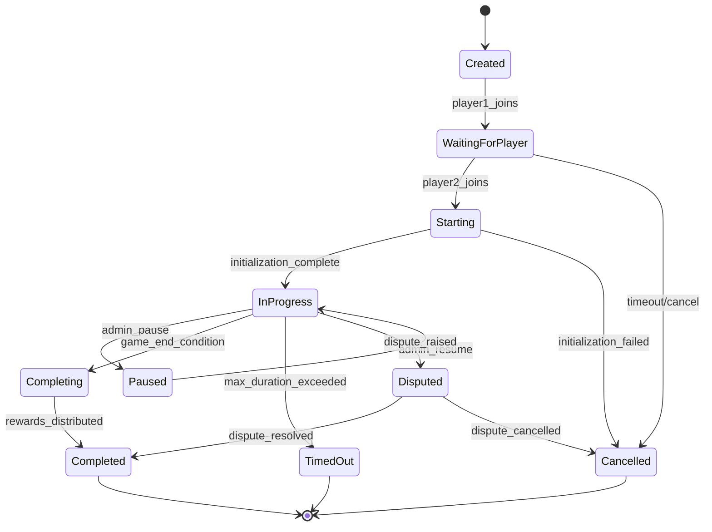
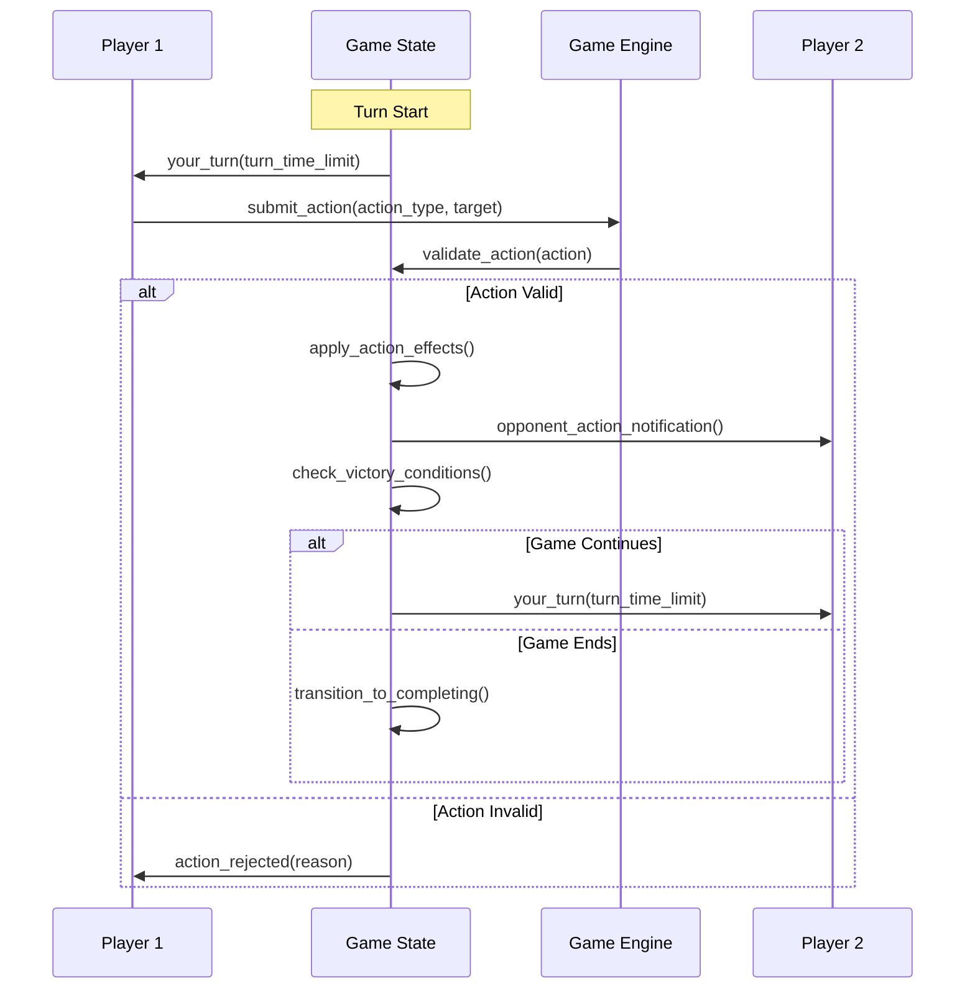

# SOL Duel - Game State Machine Design

## Overview

The SOL Duel game state machine manages the complete lifecycle of PvP dueling matches, from creation through completion, with real-time synchronization between on-chain state and off-chain game engine.

## State Machine Architecture

### Core Game States

```rust
#[derive(AnchorSerialize, AnchorDeserialize, Clone, PartialEq)]
pub enum GameStatus {
    // Initial States
    Created,              // Game instance created, no players
    WaitingForPlayer,     // One player joined, waiting for opponent
    
    // Active States  
    Starting,             // Both players ready, initializing game
    InProgress,           // Active gameplay
    Paused,              // Temporarily suspended
    
    // Resolution States
    Completing,          // Game finishing, calculating results
    Completed,           // Game finished successfully
    
    // Error States
    Cancelled,           // Cancelled before completion
    Disputed,            // Result under dispute
    TimedOut,           // Exceeded time limits
}
```

### State Transition Diagram



## Combat State Management

### Player Combat States

```rust
#[derive(AnchorSerialize, AnchorDeserialize, Clone)]
pub struct PlayerCombatState {
    pub health: u16,
    pub mana: u16,
    pub stamina: u16,
    pub position: Position,
    pub active_effects: Vec&lt;StatusEffect&gt;,
    pub cooldowns: HashMap&lt;SkillId, i64&gt;,
    pub inventory: PlayerInventory,
    pub last_action: Option&lt;PlayerAction&gt;,
    pub last_action_time: i64,
}

#[derive(AnchorSerialize, AnchorDeserialize, Clone)]
pub struct StatusEffect {
    pub effect_type: EffectType,
    pub duration: i64,
    pub magnitude: i16,
    pub applied_by: Pubkey,
    pub can_dispel: bool,
}
```

### Action Processing Pipeline

```rust
pub struct ActionProcessor {
    pub game_state: GameState,
    pub rules_engine: RulesEngine,
    pub validation_chain: Vec&lt;ActionValidator&gt;,
}

impl ActionProcessor {
    pub fn process_action(&mut self, action: PlayerAction) -&gt; Result&lt;ActionResult&gt; {
        // 1. Pre-validation
        self.validate_action_preconditions(&action)?;
        
        // 2. Action execution
        let result = self.execute_action(&action)?;
        
        // 3. State updates
        self.apply_action_effects(&result)?;
        
        // 4. Post-processing
        self.check_end_conditions()?;
        
        Ok(result)
    }
}
```

## Turn-Based Combat System

### Turn Management

```rust
#[derive(AnchorSerialize, AnchorDeserialize, Clone)]
pub struct TurnState {
    pub current_turn: u32,
    pub active_player: Pubkey,
    pub turn_start_time: i64,
    pub turn_duration: u16, // seconds
    pub actions_this_turn: Vec&lt;ActionId&gt;,
    pub turn_phase: TurnPhase,
}

#[derive(AnchorSerialize, AnchorDeserialize, Clone)]
pub enum TurnPhase {
    Planning,    // Player selecting actions
    Execution,   // Actions being processed
    Resolution,  // Effects being applied
    Transition,  // Moving to next turn
}
```

### Combat Round Flow



## Real-Time Synchronization

### State Synchronization Strategy

```rust
pub struct StateSynchronizer {
    pub on_chain_state: GameState,
    pub off_chain_state: DetailedGameState,
    pub pending_updates: Vec&lt;StateUpdate&gt;,
    pub sync_interval: Duration,
}

impl StateSynchronizer {
    pub async fn sync_state(&mut self) -&gt; Result&lt;()&gt; {
        // 1. Collect off-chain updates
        let updates = self.collect_pending_updates();
        
        // 2. Batch for on-chain submission
        let batch = self.create_update_batch(updates)?;
        
        // 3. Submit to blockchain
        self.submit_state_update(batch).await?;
        
        // 4. Update local state
        self.apply_confirmed_updates().await?;
        
        Ok(())
    }
}
```

### Event-Driven Updates

```rust
#[derive(AnchorSerialize, AnchorDeserialize, Clone)]
pub enum GameEvent {
    PlayerJoined { player: Pubkey, timestamp: i64 },
    ActionSubmitted { player: Pubkey, action: PlayerAction },
    DamageDealt { attacker: Pubkey, target: Pubkey, damage: u16 },
    EffectApplied { target: Pubkey, effect: StatusEffect },
    TurnChanged { new_active_player: Pubkey, turn_number: u32 },
    GameEnded { winner: Option&lt;Pubkey&gt;, reason: EndReason },
}
```

## Victory Conditions

### Win Condition Engine

```rust
pub struct VictoryConditionChecker {
    pub conditions: Vec&lt;VictoryCondition&gt;,
}

#[derive(AnchorSerialize, AnchorDeserialize, Clone)]
pub enum VictoryCondition {
    HealthDepletion { target_health: u16 },
    Timeout { winner_selection: TimeoutWinnerRule },
    Surrender { surrendering_player: Pubkey },
    Forfeit { forfeiting_player: Pubkey },
    Technical { reason: TechnicalEndReason },
}

impl VictoryConditionChecker {
    pub fn check_victory(&self, game_state: &GameState) -&gt; Option&lt;VictoryResult&gt; {
        for condition in &self.conditions {
            if let Some(result) = self.evaluate_condition(condition, game_state) {
                return Some(result);
            }
        }
        None
    }
}
```

### End Game Processing

```rust
pub async fn process_game_end(
    game_state: &mut GameState,
    victory_result: VictoryResult,
    ctx: &Context&lt;FinalizeGame&gt;,
) -&gt; Result&lt;()&gt; {
    // 1. Update game state
    game_state.status = GameStatus::Completing;
    game_state.winner = victory_result.winner;
    game_state.end_time = Some(Clock::get()?.unix_timestamp);
    game_state.end_reason = Some(victory_result.reason);
    
    // 2. Calculate rewards
    let rewards = calculate_game_rewards(game_state, &victory_result)?;
    
    // 3. Update player stats
    update_player_statistics(game_state, &victory_result).await?;
    
    // 4. Distribute rewards
    distribute_game_rewards(ctx, &rewards).await?;
    
    // 5. Mark game as completed
    game_state.status = GameStatus::Completed;
    
    Ok(())
}
```

## Error Recovery and Fault Tolerance

### Error State Handling

```rust
#[derive(AnchorSerialize, AnchorDeserialize, Clone)]
pub enum GameError {
    // Network errors
    ConnectionLost { last_sync: i64 },
    SyncTimeout { pending_actions: Vec&lt;ActionId&gt; },
    
    // State errors
    InvalidState { current_state: GameStatus, attempted_action: String },
    StateCorruption { detected_at: i64, checksum_mismatch: bool },
    
    // Player errors
    PlayerDisconnected { player: Pubkey, disconnect_time: i64 },
    InvalidAction { player: Pubkey, action: PlayerAction, reason: String },
    
    // System errors
    InsufficientComputeUnits { required: u32, available: u32 },
    AccountDataCorruption { account: Pubkey },
}
```

### Recovery Mechanisms

```rust
pub struct GameRecoveryManager {
    pub recovery_strategies: HashMap&lt;GameError, RecoveryStrategy&gt;,
    pub checkpoint_interval: Duration,
    pub max_recovery_attempts: u8,
}

#[derive(Clone)]
pub enum RecoveryStrategy {
    Rollback { checkpoint_id: CheckpointId },
    Pause { max_pause_duration: Duration },
    ForceEnd { default_winner: Option&lt;Pubkey&gt; },
    Restart { preserve_wagers: bool },
}
```

## State Persistence and Checkpoints

### Checkpoint System

```rust
#[derive(AnchorSerialize, AnchorDeserialize, Clone)]
pub struct GameCheckpoint {
    pub checkpoint_id: u64,
    pub game_id: u64,
    pub timestamp: i64,
    pub game_state_hash: [u8; 32],
    pub player1_state: PlayerCombatState,
    pub player2_state: PlayerCombatState,
    pub turn_state: TurnState,
    pub action_history: Vec&lt;PlayerAction&gt;,
}

impl GameCheckpoint {
    pub fn create_checkpoint(game_state: &GameState) -&gt; Result&lt;Self&gt; {
        let checkpoint = Self {
            checkpoint_id: generate_checkpoint_id(),
            game_id: game_state.game_id,
            timestamp: Clock::get()?.unix_timestamp,
            game_state_hash: compute_state_hash(game_state),
            // ... other fields
        };
        
        Ok(checkpoint)
    }
    
    pub fn validate_integrity(&self, current_state: &GameState) -&gt; bool {
        let computed_hash = compute_state_hash(current_state);
        computed_hash == self.game_state_hash
    }
}
```

## Performance Optimizations

### State Compression

```rust
pub struct CompressedGameState {
    pub version: u8,
    pub compressed_data: Vec&lt;u8&gt;,
    pub compression_algorithm: CompressionType,
    pub original_size: u32,
}

impl CompressedGameState {
    pub fn compress(game_state: &GameState) -&gt; Result&lt;Self&gt; {
        let serialized = game_state.try_to_vec()?;
        let compressed = zstd::compress(&serialized, 3)?;
        
        Ok(Self {
            version: CURRENT_VERSION,
            compressed_data: compressed,
            compression_algorithm: CompressionType::Zstd,
            original_size: serialized.len() as u32,
        })
    }
}
```

### Lazy State Loading

```rust
pub struct LazyGameState {
    pub essential_state: EssentialGameData,
    pub detailed_state: Option&lt;DetailedGameData&gt;,
    pub state_loader: Box&lt;dyn StateLoader&gt;,
}

impl LazyGameState {
    pub async fn get_detailed_state(&mut self) -&gt; Result&lt;&DetailedGameData&gt; {
        if self.detailed_state.is_none() {
            self.detailed_state = Some(
                self.state_loader.load_detailed_state(
                    self.essential_state.game_id
                ).await?
            );
        }
        
        Ok(self.detailed_state.as_ref().unwrap())
    }
}
```

## Testing and Simulation

### State Machine Testing

```rust
#[cfg(test)]
mod state_machine_tests {
    use super::*;
    
    #[tokio::test]
    async fn test_complete_game_lifecycle() {
        let mut game_state = GameState::new(1, player1_key, None);
        
        // Test state transitions
        assert_eq!(game_state.status, GameStatus::Created);
        
        game_state.add_player(player2_key)?;
        assert_eq!(game_state.status, GameStatus::WaitingForPlayer);
        
        game_state.start_game()?;
        assert_eq!(game_state.status, GameStatus::InProgress);
        
        // Simulate combat
        let action = PlayerAction::new(player1_key, ActionType::Attack { damage: 25 });
        game_state.process_action(action)?;
        
        // Test win condition
        let finishing_action = PlayerAction::new(
            player1_key, 
            ActionType::Attack { damage: 100 }
        );
        game_state.process_action(finishing_action)?;
        
        assert_eq!(game_state.status, GameStatus::Completed);
        assert_eq!(game_state.winner, Some(player1_key));
    }
    
    #[test]
    fn test_error_recovery() {
        let mut game_state = GameState::new(1, player1_key, Some(player2_key));
        game_state.status = GameStatus::InProgress;
        
        // Simulate state corruption
        let recovery_manager = GameRecoveryManager::new();
        let error = GameError::StateCorruption {
            detected_at: Clock::get().unwrap().unix_timestamp,
            checksum_mismatch: true,
        };
        
        let strategy = recovery_manager.get_recovery_strategy(&error);
        assert!(matches!(strategy, RecoveryStrategy::Rollback { .. }));
    }
}
```

This game state machine design provides a robust foundation for managing complex PvP combat scenarios with comprehensive error handling, real-time synchronization, and efficient state management.