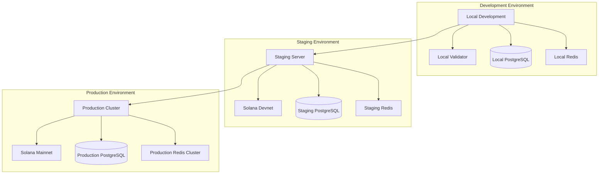
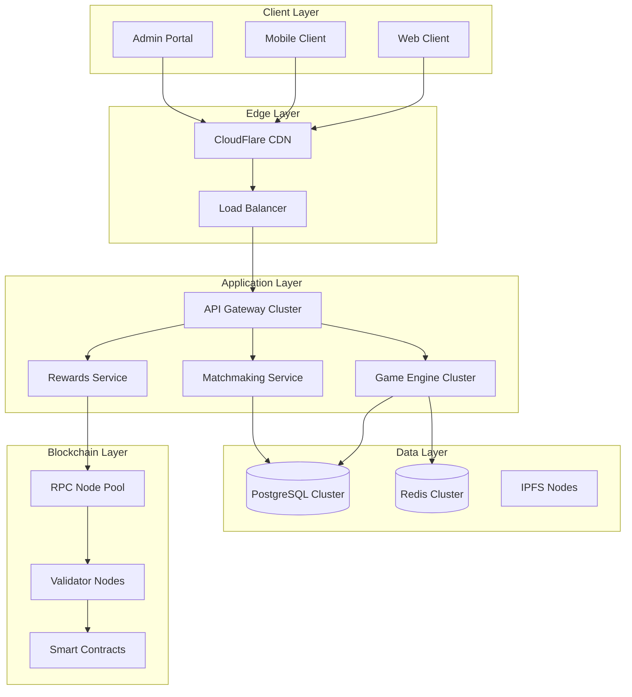

# SOL Duel - Infrastructure Design

## Overview

The SOL Duel infrastructure is designed for high-availability, scalable gaming with seamless deployment from development through production on Solana blockchain.

## Deployment Architecture

### Environment Progression



### Network Architecture



## Cloud Infrastructure

### Kubernetes Architecture

```yaml
# namespace-config.yaml
apiVersion: v1
kind: Namespace
metadata:
  name: sol-duel
  labels:
    app: sol-duel
    environment: production
---
# Service mesh configuration for microservices
apiVersion: v1
kind: ConfigMap
metadata:
  name: sol-duel-config
  namespace: sol-duel
data:
  postgres.host: "sol-duel-postgres.sol-duel.svc.cluster.local"
  redis.host: "sol-duel-redis.sol-duel.svc.cluster.local"
  solana.rpc.endpoint: "https://api.mainnet-beta.solana.com"
```

### Application Deployment

```yaml
# api-gateway-deployment.yaml
apiVersion: apps/v1
kind: Deployment
metadata:
  name: api-gateway
  namespace: sol-duel
spec:
  replicas: 3
  selector:
    matchLabels:
      app: api-gateway
  template:
    metadata:
      labels:
        app: api-gateway
    spec:
      containers:
      - name: api-gateway
        image: sol-duel/api-gateway:latest
        ports:
        - containerPort: 3000
        env:
        - name: NODE_ENV
          value: "production"
        - name: DATABASE_URL
          valueFrom:
            secretKeyRef:
              name: sol-duel-secrets
              key: database-url
        - name: REDIS_URL
          valueFrom:
            secretKeyRef:
              name: sol-duel-secrets
              key: redis-url
        resources:
          requests:
            memory: "256Mi"
            cpu: "250m"
          limits:
            memory: "512Mi"
            cpu: "500m"
        livenessProbe:
          httpGet:
            path: /health
            port: 3000
          initialDelaySeconds: 30
          periodSeconds: 10
        readinessProbe:
          httpGet:
            path: /ready
            port: 3000
          initialDelaySeconds: 5
          periodSeconds: 5
```

### Game Engine Deployment

```yaml
# game-engine-deployment.yaml
apiVersion: apps/v1
kind: Deployment
metadata:
  name: game-engine
  namespace: sol-duel
spec:
  replicas: 5
  selector:
    matchLabels:
      app: game-engine
  template:
    metadata:
      labels:
        app: game-engine
    spec:
      containers:
      - name: game-engine
        image: sol-duel/game-engine:latest
        ports:
        - containerPort: 4000
        env:
        - name: WEBSOCKET_PORT
          value: "4000"
        - name: MAX_CONCURRENT_GAMES
          value: "100"
        resources:
          requests:
            memory: "512Mi"
            cpu: "500m"
          limits:
            memory: "1Gi"
            cpu: "1000m"
        volumeMounts:
        - name: game-state-storage
          mountPath: /app/game-states
      volumes:
      - name: game-state-storage
        persistentVolumeClaim:
          claimName: game-state-pvc
```

## Solana Infrastructure

### RPC Node Configuration

```yaml
# solana-rpc-config.yaml
apiVersion: v1
kind: ConfigMap
metadata:
  name: solana-rpc-config
  namespace: sol-duel
data:
  rpc-pool.json: |
    {
      "endpoints": [
        {
          "url": "https://api.mainnet-beta.solana.com",
          "priority": 1,
          "timeout": 5000,
          "maxConcurrentRequests": 100
        },
        {
          "url": "https://solana-api.projectserum.com",
          "priority": 2,
          "timeout": 5000,
          "maxConcurrentRequests": 80
        },
        {
          "url": "https://rpc.ankr.com/solana",
          "priority": 3,
          "timeout": 5000,
          "maxConcurrentRequests": 60
        }
      ],
      "fallbackStrategy": "round-robin",
      "healthCheckInterval": 30000,
      "retryAttempts": 3,
      "circuitBreakerThreshold": 5
    }
```

### RPC Connection Pool Implementation

```typescript
// rpc-pool.ts
export class SolanaRPCPool {
  private endpoints: RPCEndpoint[];
  private currentIndex = 0;
  private healthCheckInterval: NodeJS.Timer;
  
  constructor(config: RPCPoolConfig) {
    this.endpoints = config.endpoints.map(ep => ({
      ...ep,
      connection: new Connection(ep.url, 'confirmed'),
      isHealthy: true,
      activeRequests: 0,
      lastError: null
    }));
    
    this.startHealthChecks();
  }
  
  async getConnection(): Promise<Connection> {
    const healthyEndpoints = this.endpoints.filter(ep => ep.isHealthy);
    
    if (healthyEndpoints.length === 0) {
      throw new Error('No healthy RPC endpoints available');
    }
    
    // Round-robin with load balancing
    const endpoint = this.selectEndpoint(healthyEndpoints);
    endpoint.activeRequests++;
    
    return endpoint.connection;
  }
  
  private selectEndpoint(endpoints: RPCEndpoint[]): RPCEndpoint {
    // Select endpoint with lowest active requests
    return endpoints.reduce((min, current) => 
      current.activeRequests < min.activeRequests ? current : min
    );
  }
  
  private async startHealthChecks() {
    this.healthCheckInterval = setInterval(async () => {
      for (const endpoint of this.endpoints) {
        try {
          const start = Date.now();
          await endpoint.connection.getSlot();
          endpoint.responseTime = Date.now() - start;
          endpoint.isHealthy = true;
          endpoint.lastError = null;
        } catch (error) {
          endpoint.isHealthy = false;
          endpoint.lastError = error;
          console.error(`RPC endpoint ${endpoint.url} health check failed:`, error);
        }
      }
    }, 30000);
  }
}
```

## Database Architecture

### PostgreSQL Cluster Setup

```yaml
# postgresql-cluster.yaml
apiVersion: postgresql.cnpg.io/v1
kind: Cluster
metadata:
  name: sol-duel-postgres
  namespace: sol-duel
spec:
  instances: 3
  
  postgresql:
    parameters:
      max_connections: "200"
      shared_buffers: "256MB"
      effective_cache_size: "1GB"
      maintenance_work_mem: "64MB"
      checkpoint_completion_target: "0.9"
      wal_buffers: "16MB"
      default_statistics_target: "100"
      random_page_cost: "1.1"
      
  bootstrap:
    initdb:
      database: sol_duel
      owner: sol_duel_user
      secret:
        name: sol-duel-postgres-credentials
        
  storage:
    size: 100Gi
    storageClass: fast-ssd
    
  monitoring:
    enabled: true
    prometheusRule:
      enabled: true
```

### Database Schema

```sql
-- Core game tables
CREATE TABLE players (
    id SERIAL PRIMARY KEY,
    wallet_address VARCHAR(44) UNIQUE NOT NULL,
    username VARCHAR(32) UNIQUE,
    elo_rating INTEGER DEFAULT 1000,
    wins INTEGER DEFAULT 0,
    losses INTEGER DEFAULT 0,
    total_earnings BIGINT DEFAULT 0,
    nft_profile_mint VARCHAR(44),
    created_at TIMESTAMP WITH TIME ZONE DEFAULT CURRENT_TIMESTAMP,
    updated_at TIMESTAMP WITH TIME ZONE DEFAULT CURRENT_TIMESTAMP
);

CREATE TABLE games (
    id BIGINT PRIMARY KEY,
    player1_id INTEGER REFERENCES players(id),
    player2_id INTEGER REFERENCES players(id),
    status game_status_enum NOT NULL,
    winner_id INTEGER REFERENCES players(id),
    wager_amount BIGINT NOT NULL,
    start_time TIMESTAMP WITH TIME ZONE,
    end_time TIMESTAMP WITH TIME ZONE,
    game_type game_type_enum NOT NULL,
    metadata JSONB,
    blockchain_tx_hash VARCHAR(88),
    created_at TIMESTAMP WITH TIME ZONE DEFAULT CURRENT_TIMESTAMP
);

CREATE TABLE game_actions (
    id SERIAL PRIMARY KEY,
    game_id BIGINT REFERENCES games(id),
    player_id INTEGER REFERENCES players(id),
    action_type action_type_enum NOT NULL,
    action_data JSONB NOT NULL,
    sequence_number INTEGER NOT NULL,
    timestamp TIMESTAMP WITH TIME ZONE DEFAULT CURRENT_TIMESTAMP,
    UNIQUE(game_id, sequence_number)
);

CREATE TABLE tournaments (
    id SERIAL PRIMARY KEY,
    name VARCHAR(100) NOT NULL,
    organizer_id INTEGER REFERENCES players(id),
    entry_fee BIGINT NOT NULL,
    prize_pool BIGINT NOT NULL,
    max_participants INTEGER NOT NULL,
    status tournament_status_enum NOT NULL,
    start_time TIMESTAMP WITH TIME ZONE,
    registration_deadline TIMESTAMP WITH TIME ZONE,
    bracket_data JSONB,
    created_at TIMESTAMP WITH TIME ZONE DEFAULT CURRENT_TIMESTAMP
);

-- Indexes for performance
CREATE INDEX idx_players_wallet_address ON players(wallet_address);
CREATE INDEX idx_players_elo_rating ON players(elo_rating DESC);
CREATE INDEX idx_games_status ON games(status);
CREATE INDEX idx_games_start_time ON games(start_time DESC);
CREATE INDEX idx_game_actions_game_id_sequence ON game_actions(game_id, sequence_number);
```

### Redis Cluster Configuration

```yaml
# redis-cluster.yaml
apiVersion: redis.redis.opstreelabs.in/v1beta1
kind: RedisCluster
metadata:
  name: sol-duel-redis
  namespace: sol-duel
spec:
  clusterSize: 6
  clusterVersion: v7
  persistenceEnabled: true
  
  redisExporter:
    enabled: true
    image: quay.io/opstree/redis-exporter:1.44.0
    
  storage:
    volumeClaimTemplate:
      spec:
        accessModes:
        - ReadWriteOnce
        resources:
          requests:
            storage: 10Gi
        storageClassName: fast-ssd
        
  resources:
    requests:
      cpu: 100m
      memory: 128Mi
    limits:
      cpu: 500m
      memory: 512Mi
```

### Caching Strategy

```typescript
// cache-manager.ts
export class GameCacheManager {
  private redisClient: Redis;
  
  constructor(redisConfig: RedisConfig) {
    this.redisClient = new Redis.Cluster(redisConfig.nodes);
  }
  
  // Player state caching
  async cachePlayerState(playerId: string, state: PlayerState): Promise<void> {
    const key = `player:${playerId}:state`;
    await this.redisClient.setex(key, 300, JSON.stringify(state)); // 5 min TTL
  }
  
  async getPlayerState(playerId: string): Promise<PlayerState | null> {
    const key = `player:${playerId}:state`;
    const cached = await this.redisClient.get(key);
    return cached ? JSON.parse(cached) : null;
  }
  
  // Game session caching
  async cacheGameSession(gameId: string, session: GameSession): Promise<void> {
    const key = `game:${gameId}:session`;
    await this.redisClient.setex(key, 1800, JSON.stringify(session)); // 30 min TTL
  }
  
  // Matchmaking queue
  async addToMatchmakingQueue(playerId: string, eloRating: number): Promise<void> {
    await this.redisClient.zadd('matchmaking:queue', eloRating, playerId);
    await this.redisClient.setex(`matchmaking:${playerId}`, 300, Date.now().toString());
  }
  
  async findMatches(eloRating: number, range: number): Promise<string[]> {
    return await this.redisClient.zrangebyscore(
      'matchmaking:queue',
      eloRating - range,
      eloRating + range,
      'LIMIT', 0, 10
    );
  }
}
```

## WebSocket Infrastructure

### WebSocket Server Configuration

```typescript
// websocket-server.ts
export class GameWebSocketServer {
  private io: Server;
  private gameRooms: Map<string, GameRoom> = new Map();
  
  constructor(httpServer: any) {
    this.io = new Server(httpServer, {
      cors: {
        origin: process.env.ALLOWED_ORIGINS?.split(',') || ["http://localhost:3000"],
        methods: ["GET", "POST"]
      },
      transports: ['websocket', 'polling'],
      pingTimeout: 60000,
      pingInterval: 25000
    });
    
    this.setupMiddleware();
    this.setupEventHandlers();
  }
  
  private setupMiddleware(): void {
    this.io.use(async (socket, next) => {
      try {
        // Authenticate socket connection
        const token = socket.handshake.auth.token;
        const player = await this.authenticatePlayer(token);
        socket.data.player = player;
        next();
      } catch (error) {
        next(new Error('Authentication failed'));
      }
    });
  }
  
  private setupEventHandlers(): void {
    this.io.on('connection', (socket) => {
      console.log(`Player ${socket.data.player.id} connected`);
      
      socket.on('join_game', async (gameId: string) => {
        await this.handleJoinGame(socket, gameId);
      });
      
      socket.on('submit_action', async (action: PlayerAction) => {
        await this.handlePlayerAction(socket, action);
      });
      
      socket.on('disconnect', () => {
        this.handleDisconnect(socket);
      });
    });
  }
}
```

### Load Balancing WebSockets

```yaml
# websocket-service.yaml
apiVersion: v1
kind: Service
metadata:
  name: websocket-service
  namespace: sol-duel
  annotations:
    service.beta.kubernetes.io/aws-load-balancer-type: nlb
    service.beta.kubernetes.io/aws-load-balancer-connection-idle-timeout: "3600"
spec:
  type: LoadBalancer
  sessionAffinity: ClientIP  # Sticky sessions for WebSocket
  sessionAffinityConfig:
    clientIP:
      timeoutSeconds: 3600
  ports:
  - port: 80
    targetPort: 4000
    protocol: TCP
  selector:
    app: game-engine
```

## IPFS/Arweave Integration

### Metadata Storage Strategy

```typescript
// metadata-storage.ts
export class MetadataStorageManager {
  private ipfsClient: IPFSClient;
  private arweaveClient: ArweaveClient;
  
  constructor() {
    this.ipfsClient = new IPFSClient({
      host: process.env.IPFS_HOST || 'ipfs.infura.io',
      port: 5001,
      protocol: 'https'
    });
    
    this.arweaveClient = new ArweaveClient({
      host: 'arweave.net',
      port: 443,
      protocol: 'https'
    });
  }
  
  async storePlayerNFTMetadata(metadata: NFTMetadata): Promise<string> {
    // Store in IPFS for fast access
    const ipfsHash = await this.storeInIPFS(metadata);
    
    // Store in Arweave for permanent storage
    const arweaveId = await this.storeInArweave(metadata);
    
    // Return composite URI
    return `ar://${arweaveId}?ipfs=${ipfsHash}`;
  }
  
  private async storeInIPFS(data: any): Promise<string> {
    const result = await this.ipfsClient.add(JSON.stringify(data));
    return result.path;
  }
  
  private async storeInArweave(data: any): Promise<string> {
    const transaction = await this.arweaveClient.createTransaction({
      data: JSON.stringify(data)
    });
    
    await this.arweaveClient.transactions.sign(transaction);
    await this.arweaveClient.transactions.post(transaction);
    
    return transaction.id;
  }
}
```

## Monitoring and Observability

### Prometheus Monitoring

```yaml
# monitoring-stack.yaml
apiVersion: v1
kind: ServiceMonitor
metadata:
  name: sol-duel-metrics
  namespace: sol-duel
spec:
  selector:
    matchLabels:
      app: sol-duel
  endpoints:
  - port: metrics
    path: /metrics
    interval: 30s
---
apiVersion: monitoring.coreos.com/v1
kind: PrometheusRule
metadata:
  name: sol-duel-alerts
  namespace: sol-duel
spec:
  groups:
  - name: sol-duel.rules
    rules:
    - alert: HighErrorRate
      expr: rate(http_requests_total{status=~"5.."}[5m]) > 0.1
      for: 5m
      labels:
        severity: critical
      annotations:
        summary: High error rate detected
        
    - alert: GameEngineDown
      expr: up{job="game-engine"} == 0
      for: 1m
      labels:
        severity: critical
      annotations:
        summary: Game engine instance is down
```

### Application Metrics

```typescript
// metrics.ts
import { register, Counter, Histogram, Gauge } from 'prom-client';

export const gameMetrics = {
  activeGames: new Gauge({
    name: 'sol_duel_active_games_total',
    help: 'Number of currently active games'
  }),
  
  gameCompletions: new Counter({
    name: 'sol_duel_game_completions_total',
    help: 'Total number of completed games',
    labelNames: ['result_type']
  }),
  
  gameDuration: new Histogram({
    name: 'sol_duel_game_duration_seconds',
    help: 'Game duration in seconds',
    buckets: [30, 60, 120, 300, 600, 1200]
  }),
  
  blockchainTransactions: new Counter({
    name: 'sol_duel_blockchain_transactions_total',
    help: 'Total blockchain transactions',
    labelNames: ['type', 'status']
  }),
  
  playerConnections: new Gauge({
    name: 'sol_duel_player_connections',
    help: 'Number of connected players'
  })
};
```

## Disaster Recovery

### Backup Strategy

```yaml
# backup-cronjob.yaml
apiVersion: batch/v1
kind: CronJob
metadata:
  name: database-backup
  namespace: sol-duel
spec:
  schedule: "0 2 * * *"  # Daily at 2 AM
  jobTemplate:
    spec:
      template:
        spec:
          containers:
          - name: postgres-backup
            image: postgres:14
            env:
            - name: PGPASSWORD
              valueFrom:
                secretKeyRef:
                  name: postgres-credentials
                  key: password
            command:
            - /bin/bash
            - -c
            - |
              pg_dump -h sol-duel-postgres -U sol_duel_user -d sol_duel > /backup/backup-$(date +%Y%m%d).sql
              aws s3 cp /backup/backup-$(date +%Y%m%d).sql s3://sol-duel-backups/
            volumeMounts:
            - name: backup-volume
              mountPath: /backup
          volumes:
          - name: backup-volume
            emptyDir: {}
          restartPolicy: OnFailure
```

### High Availability Configuration

```yaml
# ha-ingress.yaml
apiVersion: networking.k8s.io/v1
kind: Ingress
metadata:
  name: sol-duel-ingress
  namespace: sol-duel
  annotations:
    kubernetes.io/ingress.class: nginx
    cert-manager.io/cluster-issuer: letsencrypt-prod
    nginx.ingress.kubernetes.io/rate-limit: "100"
    nginx.ingress.kubernetes.io/ssl-redirect: "true"
spec:
  tls:
  - hosts:
    - api.solduel.com
    - game.solduel.com
    secretName: sol-duel-tls
  rules:
  - host: api.solduel.com
    http:
      paths:
      - path: /
        pathType: Prefix
        backend:
          service:
            name: api-gateway
            port:
              number: 3000
  - host: game.solduel.com
    http:
      paths:
      - path: /
        pathType: Prefix
        backend:
          service:
            name: websocket-service
            port:
              number: 80
```

This infrastructure design provides a robust, scalable foundation for SOL Duel with comprehensive monitoring, disaster recovery, and high availability features optimized for blockchain gaming.