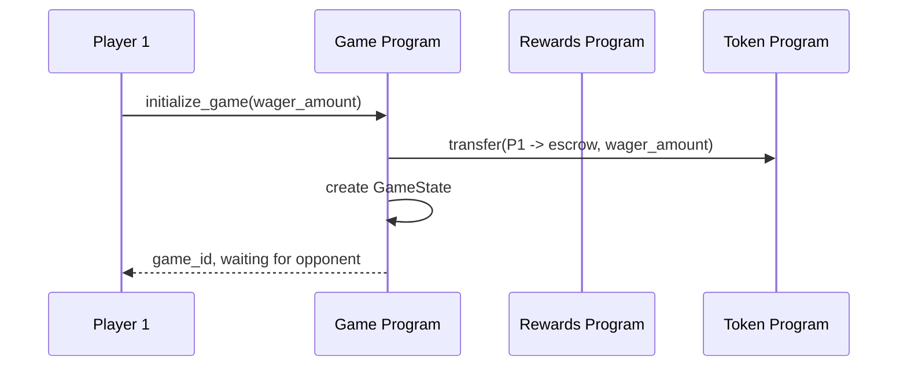
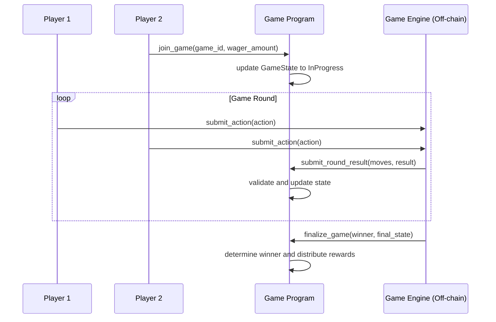

# SOL Duel - Smart Contract Architecture

## Overview

The SOL Duel smart contract architecture is built using the Anchor framework on Solana, designed for high-performance PvP gaming with token rewards and NFT integration.

## Program Structure

### Core Programs

#### 1. Game Program (`sol_duel_game`)
**Purpose**: Core game mechanics and state management

```rust
// Program ID: GAME1234...
pub mod sol_duel_game {
    use anchor_lang::prelude::*;
    
    #[program]
    pub mod game_program {
        // Game creation, execution, and finalization
    }
    
    #[account]
    pub struct GameState {
        pub game_id: u64,
        pub player1: Pubkey,
        pub player2: Pubkey,
        pub status: GameStatus,
        pub winner: Option&lt;Pubkey&gt;,
        pub start_time: i64,
        pub end_time: Option&lt;i64&gt;,
        pub wager_amount: u64,
        pub game_type: GameType,
        pub metadata: GameMetadata,
    }
    
    #[account]
    pub struct PlayerProfile {
        pub owner: Pubkey,
        pub wins: u32,
        pub losses: u32,
        pub total_games: u32,
        pub elo_rating: u16,
        pub total_earnings: u64,
        pub achievements: Vec&lt;Achievement&gt;,
        pub created_at: i64,
        pub updated_at: i64,
    }
}
```

**Key Instructions**:
- `initialize_game()`
- `join_game()`
- `submit_move()`
- `finalize_game()`
- `claim_rewards()`

#### 2. Tournament Program (`sol_duel_tournament`)
**Purpose**: Tournament bracket management and coordination

```rust
#[account]
pub struct Tournament {
    pub tournament_id: u64,
    pub organizer: Pubkey,
    pub entry_fee: u64,
    pub prize_pool: u64,
    pub max_participants: u16,
    pub current_participants: u16,
    pub status: TournamentStatus,
    pub bracket_type: BracketType,
    pub start_time: i64,
    pub registration_deadline: i64,
    pub participants: Vec&lt;Pubkey&gt;,
}

#[account]
pub struct TournamentBracket {
    pub tournament_id: u64,
    pub round: u8,
    pub matches: Vec&lt;Match&gt;,
    pub winners: Vec&lt;Pubkey&gt;,
    pub is_complete: bool,
}
```

**Key Instructions**:
- `create_tournament()`
- `register_participant()`
- `start_tournament()`
- `advance_bracket()`
- `distribute_prizes()`

#### 3. Rewards Program (`sol_duel_rewards`)
**Purpose**: Token distribution and reward calculation

```rust
#[account]
pub struct RewardPool {
    pub pool_id: u64,
    pub token_mint: Pubkey,
    pub total_amount: u64,
    pub distributed_amount: u64,
    pub reward_rate: u16, // basis points
    pub pool_type: PoolType,
    pub is_active: bool,
}

#[account]
pub struct PlayerRewards {
    pub player: Pubkey,
    pub total_earned: u64,
    pub total_claimed: u64,
    pub pending_rewards: u64,
    pub last_claim: i64,
    pub reward_multiplier: u16,
}
```

**Key Instructions**:
- `create_reward_pool()`
- `calculate_rewards()`
- `claim_rewards()`
- `distribute_tournament_prizes()`

#### 4. NFT Program (`sol_duel_nft`)
**Purpose**: Player profile NFTs and achievement system

```rust
#[account]
pub struct PlayerNFT {
    pub mint: Pubkey,
    pub owner: Pubkey,
    pub level: u8,
    pub experience: u32,
    pub attributes: NFTAttributes,
    pub visual_traits: VisualTraits,
    pub achievement_unlocks: Vec&lt;Achievement&gt;,
    pub upgrade_history: Vec&lt;Upgrade&gt;,
}

#[account]
pub struct Achievement {
    pub id: u32,
    pub name: String,
    pub description: String,
    pub rarity: Rarity,
    pub unlock_condition: UnlockCondition,
    pub reward_value: u64,
    pub unlocked_by: Vec&lt;Pubkey&gt;,
}
```

**Key Instructions**:
- `mint_player_nft()`
- `upgrade_nft()`
- `unlock_achievement()`
- `transfer_nft()`

#### 5. Governance Program (`sol_duel_governance`)
**Purpose**: DAO governance for protocol parameters

```rust
#[account]
pub struct Proposal {
    pub id: u64,
    pub proposer: Pubkey,
    pub title: String,
    pub description: String,
    pub proposal_type: ProposalType,
    pub voting_start: i64,
    pub voting_end: i64,
    pub yes_votes: u64,
    pub no_votes: u64,
    pub status: ProposalStatus,
    pub execution_ready: bool,
}
```

## Data Models

### Game State Machine

```rust
#[derive(AnchorSerialize, AnchorDeserialize, Clone, PartialEq)]
pub enum GameStatus {
    WaitingForPlayer,    // Game created, waiting for opponent
    InProgress,          // Both players joined, game active
    Paused,             // Game temporarily paused
    Completed,          // Game finished normally
    Cancelled,          // Game cancelled before completion
    Disputed,           // Result under dispute
}

#[derive(AnchorSerialize, AnchorDeserialize, Clone)]
pub enum GameType {
    QuickMatch {
        time_limit: u16,    // seconds
        rounds: u8,
    },
    RankedMatch {
        elo_range: EloRange,
        time_limit: u16,
    },
    Tournament {
        tournament_id: u64,
        bracket_position: u16,
    },
    CustomMatch {
        rules: CustomRules,
    },
}
```

### Player Actions and Combat System

```rust
#[derive(AnchorSerialize, AnchorDeserialize, Clone)]
pub struct PlayerAction {
    pub player: Pubkey,
    pub action_type: ActionType,
    pub target: Option&lt;Target&gt;,
    pub timestamp: i64,
    pub sequence_number: u32,
    pub signature: Vec&lt;u8&gt;, // Action signature for verification
}

#[derive(AnchorSerialize, AnchorDeserialize, Clone)]
pub enum ActionType {
    Attack { damage: u16, weapon_type: WeaponType },
    Defend { defense_value: u16 },
    UseItem { item_id: u32 },
    Special { skill_id: u32, mana_cost: u16 },
    Surrender,
}
```

## Security Measures

### Access Control

```rust
// Custom access control for game operations
#[derive(Accounts)]
pub struct GameAction&lt;'info&gt; {
    #[account(
        mut,
        seeds = [b"game", game_state.game_id.to_le_bytes().as_ref()],
        bump,
        constraint = game_state.status == GameStatus::InProgress
    )]
    pub game_state: Account&lt;'info, GameState&gt;,
    
    #[account(
        constraint = player.key() == game_state.player1 || 
                    player.key() == game_state.player2
    )]
    pub player: Signer&lt;'info&gt;,
    
    pub system_program: Program&lt;'info, System&gt;,
}
```

### Anti-Cheat Mechanisms

```rust
// Time-based action validation
pub fn validate_action_timing(
    action: &PlayerAction,
    last_action_time: i64,
    game_rules: &GameRules,
) -&gt; Result&lt;()&gt; {
    let current_time = Clock::get()?.unix_timestamp;
    let time_diff = current_time - last_action_time;
    
    require!(
        time_diff &gt;= game_rules.min_action_interval,
        GameError::ActionTooFast
    );
    
    require!(
        time_diff &lt;= game_rules.max_action_interval,
        GameError::ActionTimeout
    );
    
    Ok(())
}
```

### State Validation

```rust
pub fn validate_game_state(game_state: &GameState) -&gt; Result&lt;()&gt; {
    // Validate player health values
    require!(
        game_state.player1_health &lt;= 100 && 
        game_state.player2_health &lt;= 100,
        GameError::InvalidHealth
    );
    
    // Validate game timing
    require!(
        game_state.start_time &lt; Clock::get()?.unix_timestamp,
        GameError::GameNotStarted
    );
    
    Ok(())
}
```

## Program Interaction Flow

### Game Creation Flow


### Game Execution Flow


## Error Handling

```rust
#[error_code]
pub enum GameError {
    #[msg("Game is not in the correct state for this operation")]
    InvalidGameState,
    
    #[msg("Player is not authorized for this action")]
    UnauthorizedPlayer,
    
    #[msg("Insufficient funds for wager")]
    InsufficientFunds,
    
    #[msg("Action submitted too quickly")]
    ActionTooFast,
    
    #[msg("Action timeout exceeded")]
    ActionTimeout,
    
    #[msg("Invalid combat action")]
    InvalidAction,
    
    #[msg("Tournament is full")]
    TournamentFull,
    
    #[msg("Registration period has ended")]
    RegistrationClosed,
}
```

## Upgrade Strategy

### Program Upgrades
```rust
// Upgrade authority control
#[derive(Accounts)]
pub struct UpgradeProgram&lt;'info&gt; {
    #[account(
        constraint = upgrade_authority.key() == UPGRADE_AUTHORITY_PUBKEY
    )]
    pub upgrade_authority: Signer&lt;'info&gt;,
    
    #[account(mut)]
    pub program_data: Account&lt;'info, ProgramData&gt;,
}
```

### Data Migration
```rust
// Version-aware account deserialization
impl GameState {
    pub fn try_deserialize(data: &[u8]) -&gt; Result&lt;Self&gt; {
        // Check version byte
        match data[0] {
            1 =&gt; GameStateV1::try_deserialize(&data[1..])?.migrate_to_v2(),
            2 =&gt; GameStateV2::try_deserialize(&data[1..]),
            _ =&gt; Err(ProgramError::InvalidAccountData.into()),
        }
    }
}
```

## Gas Optimization

### Compute Unit Management
```rust
// Efficient state updates using minimal compute
pub fn optimize_game_update(
    game_state: &mut GameState,
    action: &PlayerAction,
) -&gt; Result&lt;()&gt; {
    // Batch multiple state updates
    match action.action_type {
        ActionType::Attack { damage, .. } =&gt; {
            let target_health = if action.player == game_state.player1 {
                &mut game_state.player2_health
            } else {
                &mut game_state.player1_health
            };
            
            *target_health = target_health.saturating_sub(damage);
            
            // Check win condition in same operation
            if *target_health == 0 {
                game_state.status = GameStatus::Completed;
                game_state.winner = Some(action.player);
                game_state.end_time = Some(Clock::get()?.unix_timestamp);
            }
        }
        _ =&gt; { /* other actions */ }
    }
    
    Ok(())
}
```

## Testing Strategy

### Unit Tests
```rust
#[cfg(test)]
mod tests {
    use super::*;
    use anchor_lang::prelude::*;
    
    #[tokio::test]
    async fn test_game_creation() {
        let program = Pubkey::new_unique();
        let player1 = Pubkey::new_unique();
        
        // Test game initialization
        let game_state = GameState {
            game_id: 1,
            player1,
            player2: Pubkey::default(),
            status: GameStatus::WaitingForPlayer,
            // ... other fields
        };
        
        assert_eq!(game_state.status, GameStatus::WaitingForPlayer);
    }
}
```

### Integration Tests
```rust
#[tokio::test]
async fn test_full_game_flow() {
    // Set up test environment
    let mut context = program_test().start_with_context().await;
    
    // Create game
    let game_id = create_test_game(&mut context).await?;
    
    // Join game
    join_test_game(&mut context, game_id).await?;
    
    // Execute game actions
    execute_test_actions(&mut context, game_id).await?;
    
    // Verify final state
    verify_game_completion(&mut context, game_id).await?;
}
```

## Deployment Configuration

### Program IDs (Devnet)
```toml
[programs.devnet]
sol_duel_game = "GAME1234567890123456789012345678901234567890"
sol_duel_tournament = "TOURN123456789012345678901234567890123456789"
sol_duel_rewards = "REWRD123456789012345678901234567890123456789"
sol_duel_nft = "NFT12345678901234567890123456789012345678901"
sol_duel_governance = "GOVN1234567890123456789012345678901234567890"

[programs.mainnet]
# Production program IDs (TBD)
```

### Build Configuration
```toml
[features]
default = []
devnet = ["anchor-lang/devnet"]
mainnet = ["anchor-lang/mainnet"]
testing = ["anchor-lang/testing"]

[dependencies]
anchor-lang = "0.28.0"
anchor-spl = "0.28.0"
```

This smart contract architecture provides a robust, scalable foundation for the SOL Duel gaming platform with comprehensive security measures and efficient state management.